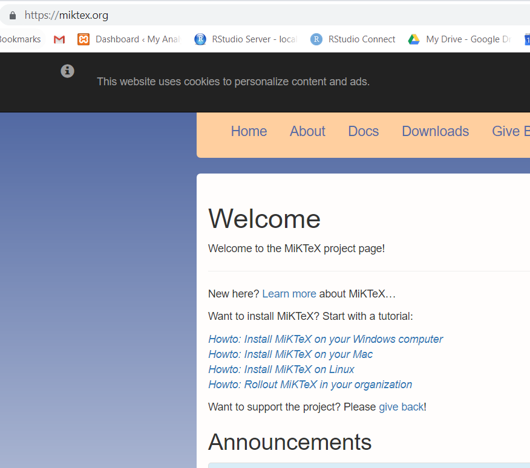
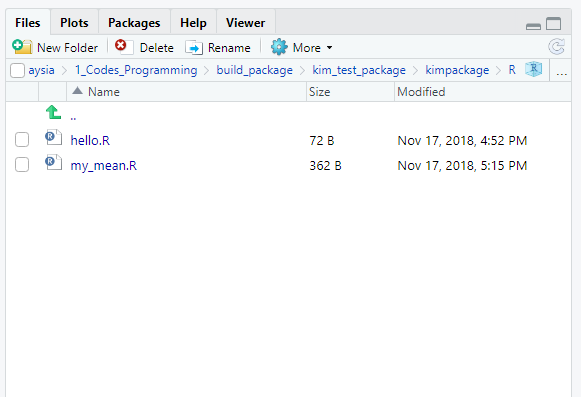

\mainmatter

# Introduction to R, RStudio\index{RStudio} and RStudio Cloud\index{RStudio cloud}

## Objectives

In this chapter, we would like to achieve these objectives: 

1. Introduce R
2. Introduce RStudio\index{RStudio}
2. Introduce RStudio Cloud\index{RStudio cloud}. This is a platform where we can run RStudio\index{RStudio} on the cloud
3. Guide readers to install R on local machine 
4. Guide readers to install RStudio on local machine 
5. Briefly describe optional installations of latex editor (Miktex or Tex Live and MacTex)
6. Demonstrate to readers how R scripts\index{R script} work
7. Describe R packages\index{Packages} and R Taskview 

## RStudio Cloud\index{RStudio cloud}

RStudio cloud\index{RStudio cloud} by RStudio\index{RStudio} facilitates the learning of R. Anyone can sign up and start using RStudio\index{RStudio} on the cloud.It is one of the the quickest way to learn R. 

By using RStudio Cloud\index{RStudio cloud}, we do not have to install R on our local machine. RStudio Cloud\index{RStudio cloud} also allows collaboration between R teachers and students. It also helps colleagues working together on R projects.

RStudio\index{RStudio} described it as a lightweight, cloud-based solution that allows anyone to do, share, teach and learn data science online. And it also adds that by using this platform, we can  

- analyze our data using the RStudio IDE\index{RStudio IDE}, directly from our browser.
- share projects with our team, class, workshop or the world.
- teach data science with R to our students or colleagues.
- learn data science in an instructor-led environment or with interactive tutorials.

RStudio Cloud\index{RStudio cloud} has the free and the commercial version (which is fortunately very affordable). To start using RStudio Cloud\index{RStudio cloud}, visit <https://rstudio.cloud/>. On the page, click `Sign Up`.

With RStudio Cloud\index{RStudio cloud}, there is almost nothing to configure and you do not need dedicated hardware, installation or annual purchase contract required. Individual users, instructors and students only need a browser to do, share, teach and learn data science.

### The RStudio Cloud\index{RStudio cloud} Registration

This is the registration and login webpage for RStudio Cloud\index{RStudio cloud}. 

### Register and log in

You can register now. After registration, you can log in. 

## Point and click R GUI

There are a number of GUI versions of R also known as R GUI. The interface resembles a popular statistical software SPSS\index{SPSS}. For example 

- Bluesky statistics\index{Bluesky statistics} <https://www.blueskystatistics.com/>
- JAMOVI\index{jamovi} - <https://www.jamovi.org/>

This is the **Bluesky statistics** software

]

And this is **jamovi** software

jamovi\index{jamovi} is an interesting software. It is a new “3rd generation” statistical spreadsheet. It is designed from the ground up to be easy to use, it is a compelling alternative to costly statistical products such as SPSS\index{SPSS} and SAS\index{SAS}. jamovi\index{jamovi} is built on top of the R statistical language, giving you access to the best the statistics community has to offer. jamovi\index{jamovi} will always be free and open because jamovi\index{jamovi} is made by the scientific community, for the scientific community.

## RStudio Server\index{RStudio server}

You can run R and RStudio\index{RStudio} on the server. To do this you have to install RStudio Workbench\index{RStudio workbench}. Previously, R Studio Workbench was known as RStudio Server\index{RStudio server}. By using RStudio Server\index{RStudio server}, R users can perform analysis on the server. Using RStudio server\index{RStudio server} can give you a taste of cloud data analysis. 

There are two versions of RStudio server\index{RStudio server}:

- RStudio Server\index{RStudio server}: This is the Open Source edition
- RStudio Workbench\index{RStudio workbench}: This is the Professional edition. 
  
At our medical school. we have RStudio Server Professional Edition (**courtesy of** RStudio, of course) running on our server here <https://healthdata.usm.my/rstudio/auth-sign-in>
  

## Installing R and RStudio\index{RStudio} on Your Local Machine  

To install R on your local machine, you have to have **Admin Right** to your machine. We recommend that you install 

- **R** first,
- then **RStudio**

### Installing R

Though you can use the native R software (that you just installed) to run R codes, we highly encourage you to use RStudio Integrated Desktop Environment (IDE)\index{RStudio IDE}. 

We will show this step by step. First, let us install R on your machine. To install R, go to [cran](https://cran.r-project.org/). Then choose the R version that's correct for your machine OS. For example, for Windows OS the link is <https://cran.r-project.org/bin/windows/base/R-4.2.1-win.exe>. And for Mac OS, the download link is  <https://cran.r-project.org/bin/macosx/base/R-4.2.1.pkg>. Similarly, if you are using Linux, follow the steps as listed before.

It is always recommended that you install the latest version of R. During this writing, the latest version is R version 4.2.1 known as Funny-Looking Kid version that was released on 2022/06/23. You can have multiple R version on the same local machines. So you do not need to uninstall the old R version in order to install a new R version.

### Installing RStudio IDE\index{RStudio IDE}

Now, to install RStudio IDE\index{RStudio IDE}, go here <https://www.rstudio.com/products/rstudio/download/#download>. Choose the supported platforms correct for your machine OS. The size of download will be around 90-110 MB.

### Checking R and RStudio\index{RStudio} Installations 

Now, we assume you have installed both R and RStudio\index{RStudio}. To make sure they work perfectly (or at least for the first time), check: 

- Does your machine can load R? Depending on your OS, go and start R.  
- what version of R do you have? When R loads, look for the version of R.
- Do you have RStudio\index{RStudio}? Depending on your OS, go and start RStudio\index{RStudio}. 
- what version of RStudio\index{RStudio} do you have? When RStudio\index{RStudio} loads, look for the version of R. If you have multiple R version, you can choose the R version of your choice by going to **Tools** then **Global Options** then **General**
- Do you need to update R and RStudio\index{RStudio}? By knowing the versions of R and RStudio\index{RStudio}, now you know if you need to update both or one of them. 

### Installation of MiKTeX, TeXLive and MacTex

It is necessary to install Latex editor if you want to convert the outputs you generated in R into PDF format. But if you do not need to produce PDF document, then you do not have to install it.   

Based on experience, as you go along, you may find it is very attractive to convert your analysis into PDF document. And because of that, you need to install the Latex editor. 

]

This is MiKTeX, for Window OS 

And this is MacTeX, for Mac OS

## Starting your RStudio\index{RStudio} 

You can either login to RStudio Cloud\index{RStudio cloud} and automatically see the RStudio interface OR you can start RStudio\index{RStudio} on your local machine by loading it. Remember, to login to RStudio Cloud\index{RStudio cloud}, go to <https://rstudio.cloud>. You will be asked for your username and password.   

Click this link <https://rstudio.cloud/spaces/156361/join?access_code=WtlSxNuTm%2Fz7E%2BLb%2FW2XnOw480%2BBTmL4B%2FqjYRIg>

To start R on your machine, and if you are using Windows, find the RStudio\index{RStudio} program in your start bar in your machine. And start it. You will see an interface like below. This is definitely different with what you see on your screen because I am using the Vibrant Ink Theme. To choose the theme of your choice, click **Global Options** then, click **Apperance**. There are a number of themes available for you to choose. 

What you see on RStudio\index{RStudio} now? You should see three panes if you start RStudio\index{RStudio} for the first time or four  panes if you have used RStudio\index{RStudio} before.

### Console tab

In Console tab, this is where we will see most of the results generated from codes in RStudio\index{RStudio}. 

### Files, Plots, Packages\index{Packages}, Help and Viewer Pane 

In this console, you will see

- List of objects (Remember, R is an object-oriented-programming or oop)
- R files, datasets, tables, list etc 

### Environment, History, Connection and Build Pane

In the environment, history, connection and build pane, you will see this

### Source Pane 

In the Source pane, you can create R files and write your R codes

