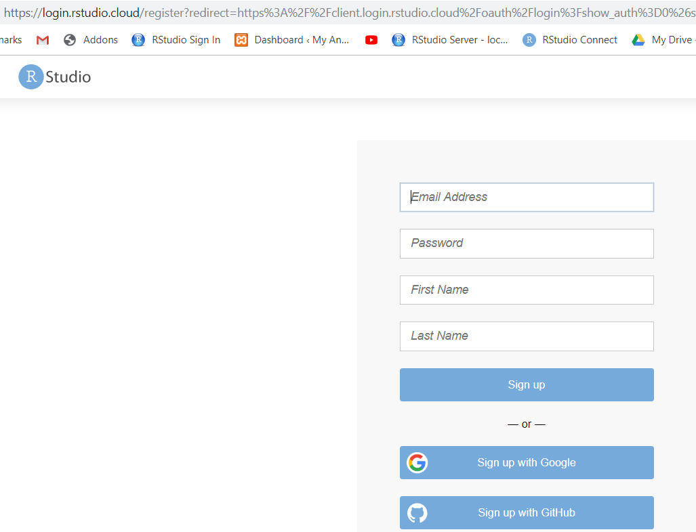
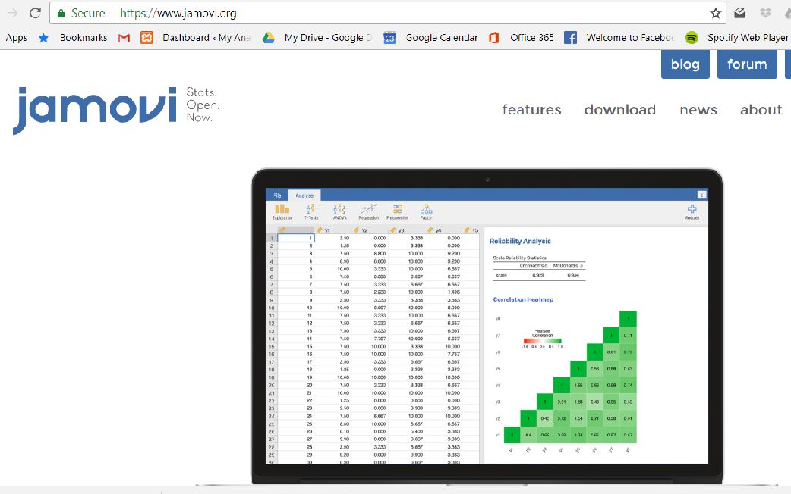
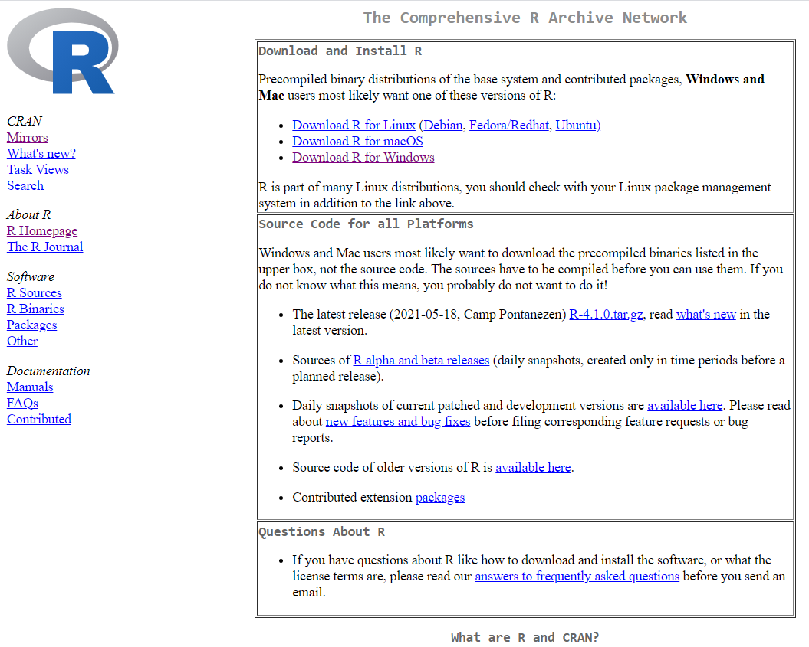
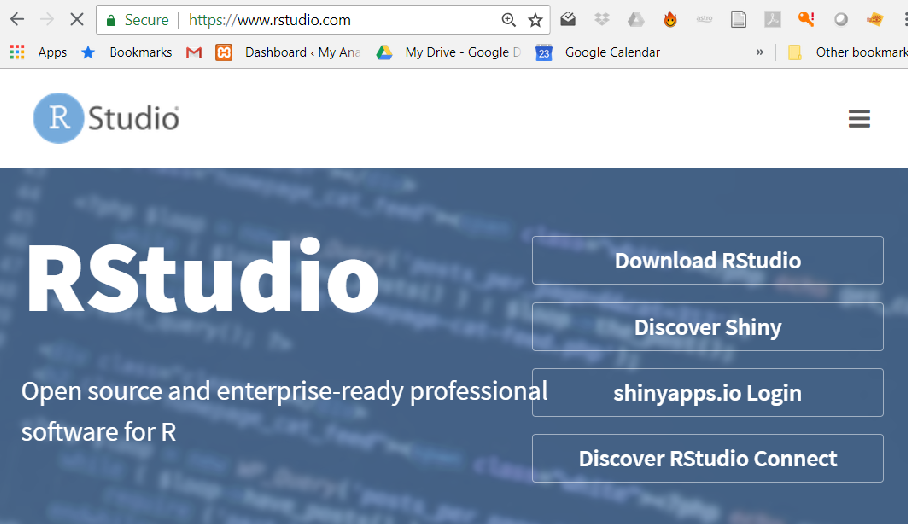
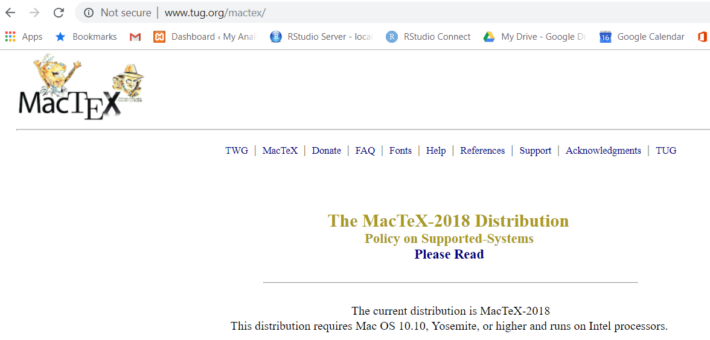
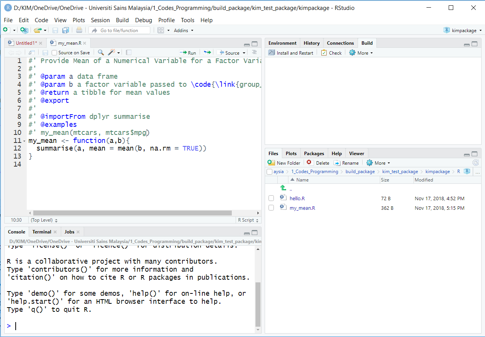
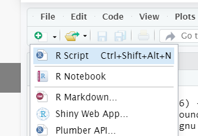

\mainmatter

# Introduction to R, RStudio and RStudio Cloud

This chapter will introduce to readers to 

- R and RStudio
- RStudio Cloud
- Installation for R and RStudio
- Optional installation for Miktex or Texlive and MacTex  
- R scripts, R packages, R Taskview


## RStudio Cloud

RStudio cloud facilitates the learning of R. Anyone can sign up and start using RStudio on the cloud.

It is one of the the quickest way to learn R. You do not need to install R on your machine. RStudio Cloud allows collaborration between teachers and students. It also helps colleagues working together on R codes. 

RStudio Cloud is free for now. To start, you need to visit <https://rstudio.cloud/> and register.


### The RStudio Cloud Interface

This is the interface for RStudio Cloud. 

[]


### Register and log in

You can register now. After registration, you can log in. 

[]


## Point and click R GUI

There are a number of SPSS-like GUI for R. For example 

- Bluesky statistics <https://www.blueskystatistics.com/>
- JAMOVI - <https://www.jamovi.org/>

This is Bluesky statistics

[]

And this is JAMOVI

[]


## RStudio Server

You can run R and RStudio on the server. To do this you have to install  RStudio Server. having RStudio Server enables you to do analysis on the server.

This will give a taste of working on BIG DATA. There are two versions of RStudio Server

- RStudio Server 
- RStudio Server Professional 
  
For example, we have our RStudio Server Professional Edition (courtesy of RStudio) running on our server here <https://healthdata.usm.my/rstudio/auth-sign-in>
  

## Installation 

To install R on your machine, you have to have **Admin Right** to your machine. We recommend that you install 

- R
- RStudio

It is optional to install Latex editor for example MiKTeX and TeXLive for Windows and MacTex for Mac OS.

### Installation for R

Though you can use R to run R codes. But we highly enciurage you to install both R and RStudio. 

To install R, go to [cran](https://cran.r-project.org/). Then choose the correct R version for your machine OS. For example, for Windows OS the link is <https://cran.r-project.org/bin/windows/base/R-3.6.1-win.exe>. And for Mac OS, the download link is  <https://cran.r-project.org/bin/macosx/R-3.6.1.pkg>. Similarly, if you are using Linux, follow the steps as listed before.

[]


### Installation for RStudio

You can install RStudio for your OS from here <https://www.rstudio.com/products/rstudio/download/#download>. Choose the supported platforms. The size of download will be around 70-90 MB.

[]


### Check R and RStudio on your machine

Now, we assume you have installed R and RStudio. Please, check 

- Do you have R? 
- what version of R do you have?
- Do you have RStudio? 
- what version of RStudio do you have?
- Do you need to update R and RStudio?


### Installation of MiKTeX, TeXLive and MacTex

It is necessary to install Latex editor if you want to convert the outputs to pdf. Especially, if you run your codes on RMarkdown. It is because RMarkdown can produce different types of documents. 

]

This is MiKTeX, for Window OS 


And this is MacTeX, for Mac OS




## Start your RStudio 


You can either login to RStudio Cloud OR start RStudio on your machine. remember, to login to RStudio Cloud, go to <https://rstudio.cloud>. Then you will be asked for your username and password.  

Click this link <https://rstudio.cloud/spaces/44275/join?access_code=LPLoq5Q4kSdtBv1AN8kcHP%2FHG0DiW1kGj4jVtG4k>


To start R on your machine, find the Rstudio program in your start bar in your machine


What you see on RStudio now? You should see three panes if you start Rstudio for the first time or four  panes if you have used RStudio before.




### Console tab

In Console tab, this is where we will see most of the results


### Files, Plots, Packages, Help and Viewer Pane 

In this console, you will see

- List of objects
- R files, datasets, tables, list etc 


### Environment, History, Connection and Build Pane

In the environment, history, connection and build pane, you will see this


### Source Pane 

In the Source pane, you can create R files and write your R codes


## Open a new R script

To open a new R script

- File -> R Script
- In Window OS, CTRL-SHIFT-N




### Our first R script

Let us write our first R script. 

- In Line 1, type `2 + 3` 
- click CTRL-ENTER or CMD-ENTER 
- see the outputs in the Console Pane

```{r}
2 + 3
```

After writing your R script, you can save it. This will allow to use or run the R script the next time you run RStudio. 

To save R script

- File ->
- Save As ->
- Choose folder ->  
- Name the file

Now, types this to check the version of R

```{r}
version[6:7]
```

The current version for R is `r version[6:7]`

If you lower version, then you want to upgrade. To upgrade

- for Windows, you can use **installr** package
- for Mac OS, you can use some functions 

More info here <https://www.linkedin.com/pulse/3-methods-update-r-rstudio-windows-mac-woratana-ngarmtrakulchol/>


### function, argument and parameters

R codes contain

- function
- argument
- parameters

```
f <- function(<arguments>) {
## Do something interesting
}
```
For example, for the function `lm()` to estimate parameters for linear regression model

```{r}
args(lm)
```


For example:

```{r}
lm(weight ~ Time, data = ChickWeight)
```

Ref: 

- <https://www.stat.auckland.ac.nz/~ihaka/downloads/Waikato-WRUG.pdf>
- <https://www.stat.berkeley.edu/~statcur/Workshop2/Presentations/functions.pdf> 


### Need more help?

Then type the ? before the function

```{r}
?lm
```

See what will be displayed in Help Pane


## Packages


### Packages on CRAN

<https://cran.r-project.org/>

- Currently, the CRAN package repository features 12784 available packages
- Cran Task Views 


### Check if the package you need is available in your R library

Type this inside your console

```{r}
library(ggplot2)
```

You should not receive any error message. If you have not installed the package, you will receive and error message. And it tells you that the package is not available in your R. the package is stored in the R folder in your My Document or HOME directory

```{r}
.libPaths()
```


### Install an R package 

To install an R package, you can type below (without the # tag)

```{r}
# install.packages(foreign, dependencies = TRUE)
```

You need to have internet access. You can install from a zip file (from your machine or USB), from github and other repo


## Directory

This is important. Not knowing your working directory will make you lost (you do not know where your R codes, R outputs, datasets etc)

You must know where your folder is located. The folder can contain many sub folders. The folder should contain dataset (if you want to analyze your data). It will later store the objects created during R session

```{r}
getwd()
```

You have to know to write file path. It is written differently for Window OS and other OS


### Starting your R job

There are 2 ways to start your job:

- create a new project (recommended)
- setting your working directory using `setwd()` (not recommended)


### Create new project

Always create a new project (This is the recommended way). This can be by 

- Go to `File -> New Project`

[]

When you see project type, click New Project


### Where is my data?

Datasets for analysis in R and usually in data frame format. You can see the datasets in the environment pane. Your data is read from the original dataset to a memory. SO you must know the size of your computer RAM. How much your RAM for your machine? The bigger the RAM, thelarger R can read and store your data. 

The data that is read (in memory) will dissaper once you close RStudio. But the original stays in its location. This will not change your original data (so be happy!)


## Upload data to RStudio Cloud

You have to upload data to RStudio Cloud  Or link data to dropbox folder


## More resources on RStudio Cloud

You can learn more about RStudio Cloud here

- on YouTube : RStudio Cloud for educationn <https://www.youtube.com/watch?v=PviVimazpz8>

- YouTube: Working with R in Cloud <https://www.youtube.com/watch?v=SFpzr21Pavg>


## Need help?

If you need help you can

-  Type a question mark infront of a function

```{r}
?plot
```

Other options are these:

- register and join RStudio Community here <https://community.rstudio.com/>
- Ask questions on Stack Overflow <https://stackoverflow.com/>
- Search for mailing list and subscribe to it
- Books on R <https://bookdown.org/>


## Bookdown

This webpage contains many useful books that use R codes <https://bookdown.org/>
 


