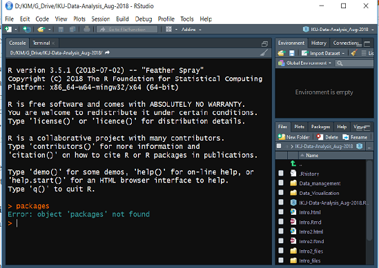

\mainmatter

# R, RStudio\index{RStudio} and RStudio Cloud\index{RStudio Cloud}

## Objectives

At the end of the chapter, the readers will

-   be introduced to the R programming language
-   be introduced to RStudio\index{RStudio} IDE
-   be introduced to RStudio Cloud\index{RStudio Cloud}. RStudio Cloud is a platform where users can run RStudio\index{RStudio} on the cloud
-   be able to install R on their local machine
-   be able to install RStudio IDE on their local machine
-   understand how to install latex editor (Miktex or Tex Live and MacTex). A latex editor is optional but is required if users want to render PDF outputs.
-   understand the structure of R scripts\index{R script} work
-   understand R packages\index{Packages} and R Taskview\index{Taskview}

## Introduction

R is a language and environment for statistical computing and graphics. It is a GNU project similar to the S language and environment developed at Bell Laboratories. R provides a wide variety of statistical (linear and nonlinear modelling, classical statistical tests, time-series analysis, classification, clustering and others) and graphical techniques and is highly extensible.

One of R's strengths is the ease with which well-designed publication-quality plots can be produced, including mathematical symbols and formulae where needed. R is available as Free Software under the terms of the Free Software Foundation's GNU General Public License in source code form. It compiles and runs on various UNIX platforms and similar systems (including FreeBSD and Linux), Windows and macOS.

## RStudio IDE\index{RStudio IDE}

RStudio is an integrated development environment (IDE) for R. It includes a console and syntax-highlighting editor that supports direct code execution and tools for plotting, history, debugging and workspace management.

RStudio is available in open source and commercial editions and runs on the desktop (Windows, Mac, and Linux) or in a browser connected to RStudio Server or RStudio Workbench (Debian/Ubuntu, Red Hat/CentOS, and SUSE Linux).

## RStudio Cloud\index{RStudio Cloud}

RStudio Cloud\\index{RStudio Cloud} by RStudio\\index{RStudio} facilitates the learning of R. Anyone can sign up and start using RStudio\\index{RStudio} on the cloud. It is one of the quickest ways to learn R.

Using RStudio Cloud\\index{RStudio Cloud}, we do not have to install R on our local machine. RStudio Cloud\\index{RStudio Cloud} allows collaboration between R teachers and students. It also helps colleagues work together on R projects.

RStudio\\index{RStudio} described it as a lightweight, cloud-based solution that allows anyone to do, share, teach and learn data science online. And it also adds that by using this platform, we can

-   analyze our data using the RStudio IDE\\index{RStudio IDE}, directly from our browser.

-   share projects with our team, class, workshop or the world.

-   teach data science with R to our students or colleagues.

-   learn data science in an instructor-led environment or with interactive tutorials.

RStudio Cloud\\index{RStudio Cloud} has the free and the commercial version (which is fortunately very affordable). To start using RStudio Cloud\\index{RStudio Cloud}, visit <https://rstudio.cloud/>. On the page, click \`Sign Up\`.

{width="60%"}

With RStudio Cloud\index{RStudio Cloud}, there is almost nothing to configure and you do not need dedicated hardware, installation or annual purchase contract required. Individual users, instructors and students only need a browser to do, share, teach and learn data science.

### The RStudio Cloud\index{RStudio Cloud} Registration

This is the registration and login webpage for RStudio Cloud\index{RStudio Cloud}.

{width="60%"}

### Register and log in

Proceed with registration. If you have Google account or GitHub account, you can use either one to quickly register. After you complete the registration, you can log into RStudio Cloud.

{width="60%"}

## Point and click R Graphical User Interface (GUI)

There are a number of GUI versions of R also known as R GUI. The interface resembles a popular statistical software SPSS\index{SPSS}. For example there are

-   Bluesky statistics\index{Bluesky statistics} <https://www.blueskystatistics.com/>
-   JAMOVI\index{jamovi} - <https://www.jamovi.org/>

BlueSky Statistics can help users to

-   migrate from expensive propriety statistical applications to R.
-   ease the R learning curve.
-   use the cutting edge analytics available in R without having to learn programming.
-   get results in true word processing tables automatically.
-   quickly add your own menus and dialog boxes to any R functions.

{width="70%"}

And this is **jamovi** software. jamovi aims to be a neutral platform, and takes no position with respect to competing statistical philosophies. The project was not founded to promote a particular statistical ideology, instead wanting to serve as a safe space where different statistical approaches might be published side-by-side, and consider themselves first-rate members of the jamovi community.

{width="70%"}

jamovi\index{jamovi} is an interesting software. It is a new "3rd generation" statistical spreadsheet. It is designed from the ground up to be easy to use, it is a compelling alternative to costly statistical products such as SPSS\index{SPSS} and SAS\index{SAS}. jamovi\index{jamovi} is built on top of the R statistical language, giving you access to the best the statistics community has to offer. jamovi\index{jamovi} will always be free and open because jamovi\index{jamovi} is made by the scientific community, for the scientific community.

## RStudio Server\index{RStudio server}

You can run R and RStudio\index{RStudio} on the server. To do this you have to install RStudio Workbench\index{RStudio workbench}. Previously, R Studio Workbench was known as RStudio Server\index{RStudio server}. By using RStudio Server\index{RStudio server}, R users can perform analysis on the server. Using RStudio server\index{RStudio server} can give you a taste of cloud data analysis.

There are two versions of RStudio server\index{RStudio server}:

-   RStudio Server\index{RStudio server}: This is the Open Source edition
-   RStudio Workbench\index{RStudio workbench}: This is the Professional edition.

At our medical school. we have RStudio Server Professional Edition (**courtesy of** RStudio, of course) running on our server here <https://healthdata.usm.my/rstudio/auth-sign-in>

## Installing R and RStudio\index{RStudio} on Your Local Machine

To install R on your local machine, you have to have **Admin Right** to your machine. We recommend that you install

-   **R** first,
-   then **RStudio**

### Installing R

Though you can use the native R software (that you just installed) to run R codes, we highly encourage you to use RStudio Integrated Desktop Environment (IDE)\index{RStudio IDE}.

We will show this step by step. First, let us install R on your machine. To install R, go to [cran](https://cran.r-project.org/). Then choose the R version that's correct for your machine OS. For example, for Windows OS the link is <https://cran.r-project.org/bin/windows/base/R-4.2.1-win.exe>. And for Mac OS, the download link is <https://cran.r-project.org/bin/macosx/base/R-4.2.1.pkg>. Similarly, if you are using Linux, follow the steps as listed before.

{width="70%"}

It is always recommended that users install the latest version of R. During this writing, the latest version is R version 4.2.1 known as Funny-Looking Kid version that was released on 2022/06/23. Users can have multiple R versions on the same local machines. So you do not need to uninstall the old R version to install a new R version.

### Installing RStudio IDE\index{RStudio IDE}

Now, to install RStudio IDE\index{RStudio IDE}, go to the RStudio [download](https://www.rstudio.com/products/rstudio/download/#download) page. Choose the supported platforms correct for your machine OS. The size of the download will be around 90-110 MB.

{width="60%"}

### Checking R and RStudio\index{RStudio} Installations

Now, we assume you have installed both R and RStudio\index{RStudio}. To make sure they work perfectly (or at least for the first time), check:

-   Does your machine can load R? Depending on your OS, go and start R.

-   what version of R do you have? When R loads, look for the version of R.

-   Do you have RStudio\index{RStudio}? Depending on your OS, go and start RStudio\index{RStudio}.

-   what version of RStudio\index{RStudio} do you have? When RStudio\index{RStudio} loads, look for the version of R. If you have multiple R version, you can choose the R version of your choice by going to **Tools** then **Global Options** then **General**

-   Do you need to update R and RStudio\index{RStudio}? By knowing the versions of R and RStudio\index{RStudio}, now you know if you need to update both or one of them.

### TinyTeX, MiKTeX or MacTeX (for Mac OS) and TeX Live

Based on experience, as R users develop more R skills, they may find converting their analysis into PDF documents desirable. It is necessary to install Latex editor if they want to convert the outputs they generated in R into PDF format. However, if they do not need to produce a PDF document, they do not have to install it. If they require more flexibility to edit their latex codes, then they may think of getting common latex editors such as Miktex, MacTex or Tex Live.

We encourage users to first install TinyTeX. If you render your R document into PDF just by using TinyTeX, then that's enough. To install TinyTeX, follow the instruction from <https://yihui.org/tinytex/> . For R users, it is simple running these two codes `install.packages('tinytex')` and `tinytex::install_tinytex()`

{width="40%"}

Install **MiKTeX** as your latex editor if your machine is using Window OS. If you use MacOS, then install **MacTeX**.

{width="60%"}

{width="60%"}

## Starting your RStudio\index{RStudio}

You can either login to RStudio Cloud\index{RStudio Cloud} and automatically see the RStudio interface OR you can start RStudio\index{RStudio} on your local machine by loading it. Remember, to login to RStudio Cloud\index{RStudio Cloud}, go to <https://rstudio.cloud>. You will be asked for your username and password.

Click this [link](https://rstudio.cloud/spaces/156361/join?access_code=WtlSxNuTm%2Fz7E%2BLb%2FW2XnOw480%2BBTmL4B%2FqjYRIg)

{width="60%"}

To start R on your machine, and if you are using Windows, find the RStudio\index{RStudio} program in your start bar on your machine. And start it. You will see an interface like the one below. This interface differs from what you see on your screen because I use the Vibrant Ink Theme. To choose the theme of your choice, click Global Options, then click Appearance. There are several themes available for you to choose.

{width="60%"}

What you see on RStudio\index{RStudio} now? You should see three panes if you start RStudio\index{RStudio} for the first time or four panes if you have used RStudio\index{RStudio} before.

{width="60%"}

### Console tab

In Console tab, this is where we will see most of the results generated from codes in RStudio\index{RStudio}.

{width="60%"}

### Files, Plots, Packages\index{Packages}, Help and Viewer Pane

In this console, you will see

-   List of objects (Remember, R is an object-oriented-programming or oop)
-   R files, datasets, tables, list etc

{width="60%"}

### Environment, History, Connection and Build Pane

In the environment, history, connection and build pane, you will see this

{width="60%"}

### Source Pane

In the Source pane, you can create R files and write your R codes

{width="40%"}

## Summary

In this chapter, we learn about R, RStudio IDE and RStudio Cloud. We have also introduced two point and click R GUIs Bluesky Statistics and jamovi. To use RStudio without any hassle during installation, we recommend using RStudio Cloud.
