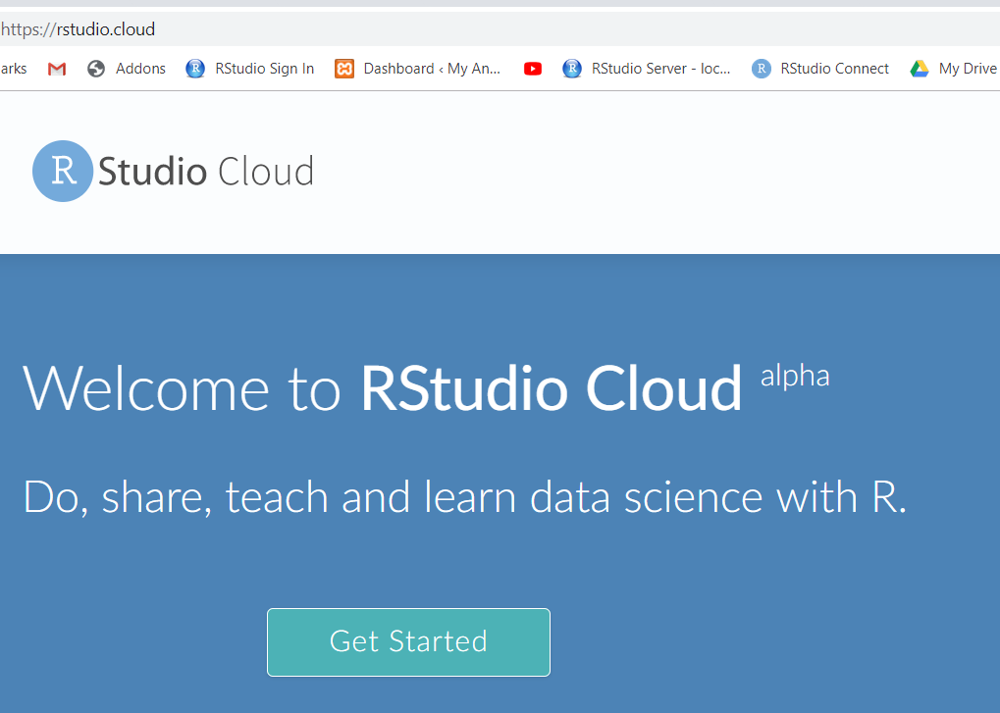
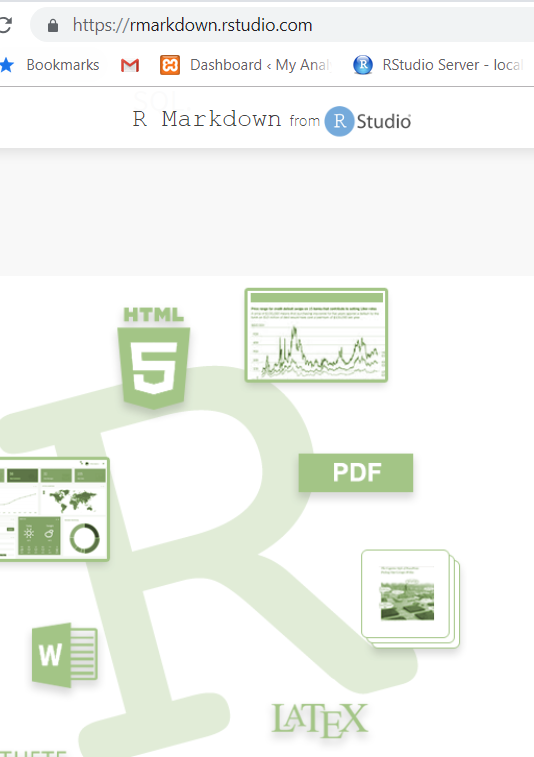
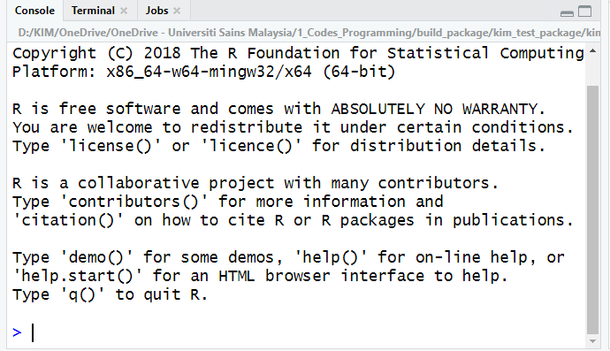
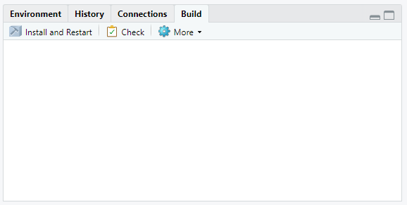
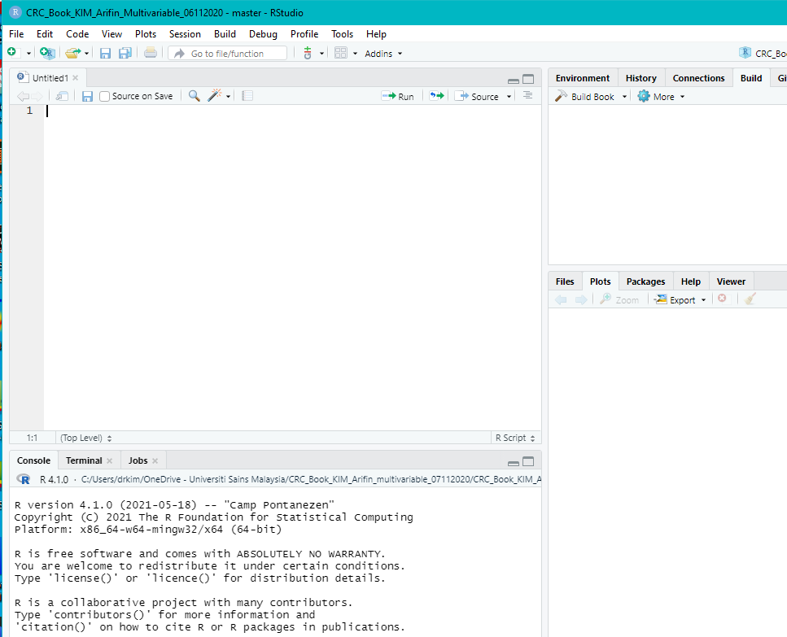
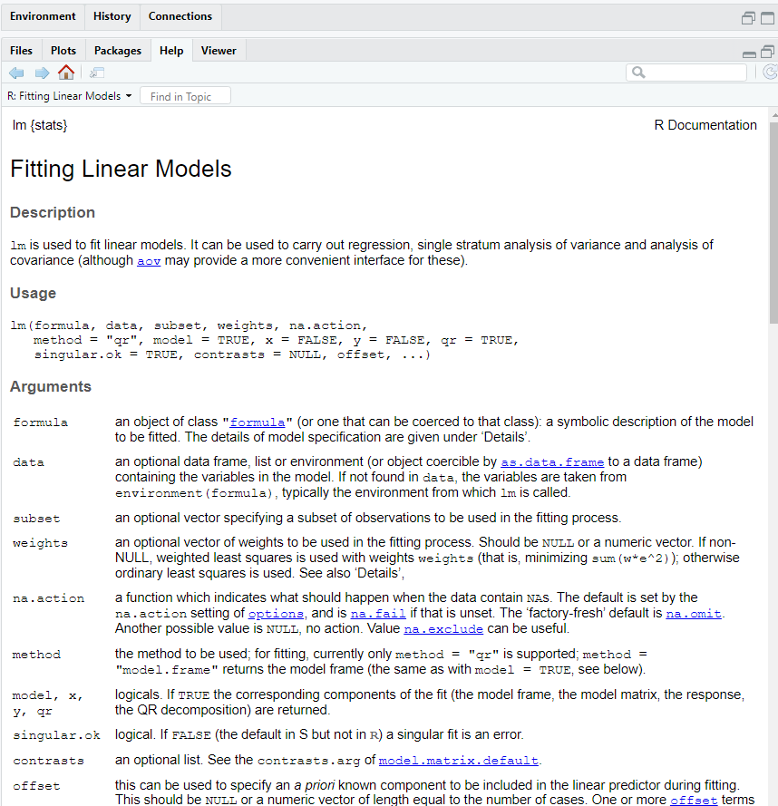
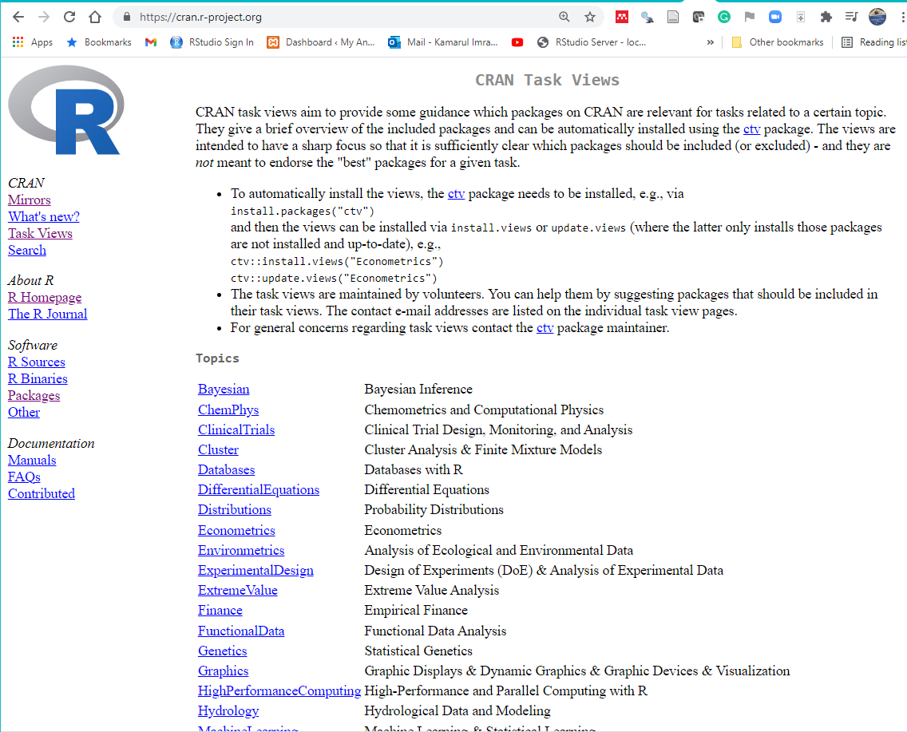
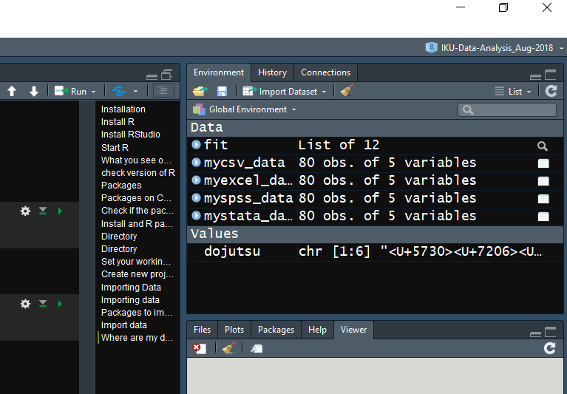
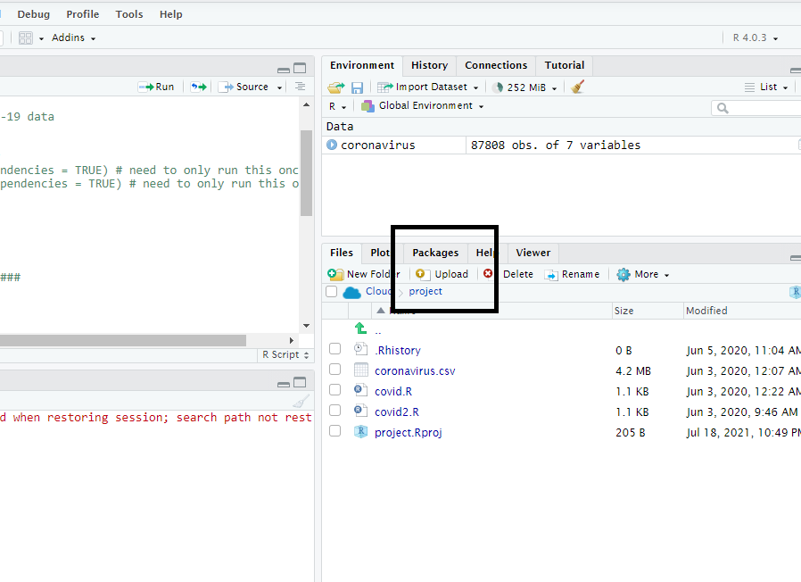
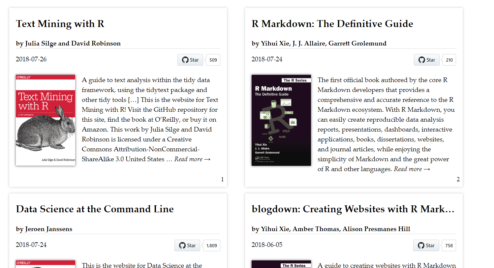

\mainmatter

# Introduction to R, RStudio and RStudio Cloud

In this chapter, we would like to achieve these objectives: 

1. To introduce R
2. To introduce RStudio
2. To introduce RStudio Cloud. This is a platform where we can run RStudio on the cloud
3. To guide to install R in your local machine 
4. To guide to install RStudio in your local machine 
5. To show readers to install optional; latex editor (Miktex or Texlive and MacTex)
6. To demonstrate to readers how R scripts work
7. To describe R packages and R Taskview 

## RStudio Cloud

RStudio cloud facilitates the learning of R. Anyone can sign up and start using RStudio on the cloud.It is one of the the quickest way to learn R. 

By using RStudio Cloud, we do not need to install R on our local machine. RStudio Cloud also allows collaboration between R teachers and students. It also helps colleagues working together on R codes.

On its webpage, RStudio is described as a lightweight, cloud-based solution that allows anyone to do, share, teach and learn data science online. And it also adds that by using this exciting platform, it means we can  

- analyze our data using the RStudio IDE, directly from our browser.
- share projects with our team, class, workshop or the world.
- teach data science with R to our students or colleagues.
- learn data science in an instructor-led environment or with interactive tutorials.

RStudio Cloud has the free and the commercial version (which is fortunately very affordable). To start using RStudio Cloud, visit <https://rstudio.cloud/>. On the page, click `Sign Up`.


With RStudio Cloud, there is almost nothing to configure and you do not need dedicated hardware, installation or annual purchase contract required. Individual users, instructors and students only need a browser to do, share, teach and learn data science.


### The RStudio Cloud Registration

This is the registration and login webpage for RStudio Cloud. 




### Register and log in

You can register now. After registration, you can log in. 


## Point and click R GUI

There are a number of the so-called SPSS-like GUI for R. For example 

- Bluesky statistics <https://www.blueskystatistics.com/>
- JAMOVI - <https://www.jamovi.org/>

This is the **Bluesky statistics** software

]

And this is **jamovi** software


jamovi is an interesting software. It is a new “3rd generation” statistical spreadsheet. It is designed from the ground up to be easy to use, it is a compelling alternative to costly statistical products such as SPSS and SAS. jamovi is built on top of the R statistical language, giving you access to the best the statistics community has to offer. jamovi will always be free and open because jamovi is made by the scientific community, for the scientific community.

## RStudio Server

You can run R and RStudio on the server. To do this you have to install RStudio Server. By having RStudio Server, it enables you to do analysis on the server. Using RStudio server can give you a taste of working on BIG DATA ON THE CLOUD. 

There are two versions of RStudio Server

- RStudio Server: This is the Open Source edition
- RStudio Workbench: This is the Professional edition. 
  
At our medical school. we have RStudio Server Professional Edition (**courtesy of** RStudio, of course) running on our server here <https://healthdata.usm.my/rstudio/auth-sign-in>
  

## Installing R and RStudio on Your Local Machine  

To install R on your local machine, you have to have **Admin Right** to your machine. We recommend that you install 

- **R** first,
- then **RStudio**


### Installing R

Though you can use the native R software (that you just installed) to run R codes, we highly encourage you to use RStudio Integrated Desktop Environment (IDE). 

We will show this step by step. First, let us install R on your machine. To install R, go to [cran](https://cran.r-project.org/). Then choose the R version that's correct for your machine OS. For example, for Windows OS the link is <https://cran.r-project.org/bin/windows/base/R-3.6.1-win.exe>. And for Mac OS, the download link is  <https://cran.r-project.org/bin/macosx/R-3.6.1.pkg>. Similarly, if you are using Linux, follow the steps as listed before.


It is always recommended that you install the latest version of R. And you can have multiple R version on the same local machines. So you do not need to uninstall the old R version in order to install a new R version.


### Installing RStudio IDE

Now, to install RStudio IDE, go here <https://www.rstudio.com/products/rstudio/download/#download>. Choose the supported platforms correct for your machine OS. The size of download will be around 90-110 MB.


### Checking R and RStudio Installations 

Now, we assume you have installed both R and RStudio. To make sure they work perfectly (or at least for the first time), check: 

- Does your machine can load R? Depending on your OS, go and start R.  
- what version of R do you have? When R loads, look for the version of R.
- Do you have RStudio? Depending on your OS, go and start RStudio. 
- what version of RStudio do you have? When RStudio loads, look for the version of R. If you have multiple R version, you can choose the R version of your choice by going to **Tools** then **Global Options** then **General**
- Do you need to update R and RStudio? By knowing the versions of R and RStudio, now you know if you need to update both or one of them. 


### Installation of MiKTeX, TeXLive and MacTex

It is necessary to install Latex editor if you want to convert the outputs you generated in R into PDF format. But if you do not need to produce PDF document, then you do not have to install it.   

Based on experience, as you go along, you may find it is very attractive to convert your analysis into PDF document. And because of that, you need to install the Latex editor. 

]

This is MiKTeX, for Window OS 


And this is MacTeX, for Mac OS


## Starting your RStudio 

You can either login to RStudio Cloud and automatically see the RStudio interface OR you can start RStudio on your local machine by loading it. Remember, to login to RStudio Cloud, go to <https://rstudio.cloud>. You will be asked for your username and password.   

Click this link <https://rstudio.cloud/spaces/156361/join?access_code=WtlSxNuTm%2Fz7E%2BLb%2FW2XnOw480%2BBTmL4B%2FqjYRIg>


To start R on your machine, and if you are using Windows, find the Rstudio program in your start bar in your machine. And start it. You will see an interface like below. This is definitely different with what you see on your screen because I am using the Vibrant Ink Theme. To choose the theme of your choice, click **Global Options** then, click **Apperance**. There are a number of themes available for you to choose. 


What you see on RStudio now? You should see three panes if you start Rstudio for the first time or four  panes if you have used RStudio before.


### Console tab

In Console tab, this is where we will see most of the results generated from codes in RStudio. 




### Files, Plots, Packages, Help and Viewer Pane 

In this console, you will see

- List of objects (Remember, R is an object-oriented-programming or oop)
- R files, datasets, tables, list etc 


### Environment, History, Connection and Build Pane

In the environment, history, connection and build pane, you will see this




### Source Pane 

In the Source pane, you can create R files and write your R codes




## Open a new R script

For beginner, you may start by writing some simple codes. To do this, go to **File**, then click **R Script**

- File -> R Script
- In Window OS, CTRL-SHIFT-N


### Our first R script

Let us write our very first R codes inside an R script. 

- In Line 1, type `2 + 3` 
- click CTRL-ENTER or CMD-ENTER 
- see the outputs in the Console Pane

```{r}
2 + 3
```

After writing your codes inside the R script, you can save the R script file. This will allow you to open it up again to continue your work. 

And to save R script, go to 

- File ->
- Save As ->
- Choose folder ->  
- Name the file

Now, types this to check the version of R

```{r}
version[6:7]
```

The current version for R is `r version[6:7]`

If you lower version, then you want to upgrade. To upgrade

- for Windows, you can use **installr** package
- for Mac OS, you can use some functions 

More info here <https://www.linkedin.com/pulse/3-methods-update-r-rstudio-windows-mac-woratana-ngarmtrakulchol/>


### Function, Argument and Parameters

R codes contain

- function
- argument
- parameters

```
f <- function(<arguments>) {
## Do something interesting
}
```
For example, for the function `lm()` to estimate parameters for linear regression model

```{r}
args(lm)
```

For example:

```{r}
lm(weight ~ Time, data = ChickWeight)
```

### Need more help?

Then type the ? before the function

```{r}
?lm
```

See what will be displayed in Help Pane




## Packages

R is a programming language. And R software runs on packages. R packages are collections of functions and data sets developed by the community. They increase the power of R by improving existing base R functionalities, or by adding new ones. 

A package is a suitable way to organize your own work and, if you want to, share it with others. Typically, a package will include code (not only R code!), documentation for the package and the functions inside, some tests to check everything works as it should, and data sets. ^[https://www.datacamp.com/community/tutorials/r-packages-guide]

### Packages on CRAN

<https://cran.r-project.org/>

- Currently, the CRAN package repository features 12784 available packages
- Cran Task Views 




### Check if the package you need is available in your R library

Type this inside your console

```{r}
library(ggplot2)
```

You should not receive any error message. If you have not installed the package, you will receive and error message. And it tells you that the package is not available in your R. the package is stored in the R folder in your My Document or HOME directory

```{r}
.libPaths()
```


### Install an R package 

To install an R package, you can type below (without the # tag)

```{r}
# install.packages(foreign, dependencies = TRUE)
```

You need to have internet access. You can install from a zip file (from your machine or USB), from github and other repo


## Directory

This is important. Not knowing your working directory will make you lost (you do not know where your R codes, R outputs, datasets etc)

You must know where your folder is located. The folder can contain many sub folders. The folder should contain dataset (if you want to analyze your data). It will later store the objects created during R session

```{r}
getwd()
```

You have to know to write file path. It is written differently for Window OS and other OS


### Starting your R job

There are 2 ways to start your job:

- create a new project (recommended)
- setting your working directory using `setwd()` (not recommended)


### Create new project

Always create a new project (This is the recommended way). This can be by 

- Go to `File -> New Project`

[]

When you see project type, click New Project


### Where is my data?

Datasets for analysis in R and usually in data frame format. You can see the datasets in the environment pane. Your data is read from the original dataset to a memory. SO you must know the size of your computer RAM. How much your RAM for your machine? The bigger the RAM, thelarger R can read and store your data. 

The data that is read (in memory) will dissaper once you close RStudio. But the original stays in its location. This will not change your original data (so be happy!)




## Upload data to RStudio Cloud

You have to upload data to RStudio Cloud  Or link data to dropbox folder




## More resources on RStudio Cloud

You can learn more about RStudio Cloud here

- on YouTube : RStudio Cloud for educationn <https://www.youtube.com/watch?v=PviVimazpz8>

- YouTube: Working with R in Cloud <https://www.youtube.com/watch?v=SFpzr21Pavg>


## Need help?

If you need help you can

-  Type a question mark infront of a function

```{r}
?plot
```

Other options are these:

- register and join RStudio Community here <https://community.rstudio.com/>
- Ask questions on Stack Overflow <https://stackoverflow.com/>
- Search for mailing list and subscribe to it
- Books on R <https://bookdown.org/>


## Bookdown

This webpage contains many useful books that use R codes <https://bookdown.org/>. 
 


