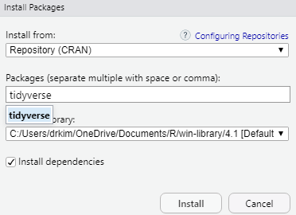

# R Scripts and R Packages

## Introduction


## Objectives 

In this chapter, we would like to achieve these objectives: 

-
-
-


## Open a new R script

For beginner, you may start by writing some simple codes. Since these codes are written in R language, we call these codes as \index{R scripts}. To do this, go to **File**, then click **R Script**

- File -> R Script
- In Window OS, CTRL-SHIFT-N


### Our first R script

Let us write our very first R codes inside an R script. 

- In Line 1, type `2 + 3` 
- click CTRL-ENTER or CMD-ENTER 
- see the outputs in the Console Pane

```{r}
2 + 3
```

After writing your codes inside the R script, you can save the R script file. This will allow you to open it up again to continue your work. 

And to save R script, go to 

- File ->
- Save As ->
- Choose folder ->  
- Name the file

Now, types this to check the version of R

```{r}
version[6:7]
```

The current version for R is `r version[6:7]`

If you lower version, then you want to upgrade. To upgrade

- for Windows, you can use **installr** package
- for Mac OS, you can use some functions 

More info here <https://www.linkedin.com/pulse/3-methods-update-r-rstudio-windows-mac-woratana-ngarmtrakulchol/>


### Function, Argument and Parameters

R codes contain

- function
- argument
- parameters

```
f <- function(<arguments>) {
## Do something interesting
}
```
For example, for the function `lm()` to estimate parameters for linear regression model

```{r}
args(lm)
```

For example:

```{r}
lm(weight ~ Time, data = ChickWeight)
```

### Need more help?

Then type the ? before the function

```{r}
?lm
```

See what will be displayed in Help Pane


## Packages

R is a programming language. And R software runs on \index{packages}. R packages are collections of functions and data sets developed by the community. They increase the power of R by improving existing base R codes and functions, or by adding new ones. 

A package is a suitable way to organize your own work and, if you want to, share it with others. Typically, a package will include code (not only R code!), documentation for the package and the functions inside, some tests to check everything works as it should, and data sets. 

Ypu can read more about R packages here <https://www.datacamp.com/community/tutorials/r-packages-guide> 

### Packages on CRAN

<https://cran.r-project.org/>

- At the time of writing, the CRAN package repository features 12784 packages
- Cran Task Views 


CRAN \index{task views} aim to provide some guidance which packages on CRAN are relevant for tasks related to a certain topic. They give a brief overview of the included packages and can be automatically installed using the **ctv** package. The views are intended to have a sharp focus so that it is sufficiently clear which packages should be included (or excluded) and they are not meant to endorse the "best" packages for a given task.

### Check if the package you need is available in your R library

Type this inside your \index{R console}

```{r}
library(tidyverse)
```

You should not receive any error message. If you have not installed the package, you will receive and error message. And it tells you that the package is not available in your R. By default the package is stored in the R folder in your My Document or HOME directory

```{r}
.libPaths()
```


### Install an R package 

To install an \index{R package}, there are two ways:

1. you can type below (without the # tag)

```{r}
# install.packages(tidyverse, dependencies = TRUE)
```

2. using the GUI


Now, type the package you want to install. For example you want to install the **tidyverse** package



And then click the `Install` button. And you need to have internet access to do this. You can also install packages from: 

- a zip file (from your machine or USB), 
- from github repository
- other repository


## Directory

Setting and knowing the \index{R working directory} is very important. Our working directory will contain the R codes, the R outputs, datasets or even resources or tutorials that can help us during in R project or during our R analysis/ 

The working directory is a just a folder. And the folder can contain many sub folders. We recommend that the folder contain the dataset (if you want to analyze your data locally) in addition to other R objects. R will store many other R objects created during each R session. 

Type this to locate the working directiry:

```{r}
getwd()
```


### Starting your R job

There are 2 ways to start your job:

- create a new \index{R project} from RStudio IDE. This is the method that we recommend. 
- setting your working directory using the `setwd()` function. 


### Create new R project

We highly encourage users create a new R project. We can do this by 

- Go to `File -> New Project`

[]

When you see project type, click New Project


### Where is my data?

Many analysts use data stored in their local machine. R will read data and usually store this data in data frame format or class. When you read your data into RStudio, you will see the dataset in the \index{environment pane}. RStudio reads the original dataset and save in to the RAM (random access memory). SO you must know the size of your computer RAM. How much your RAM for your machine? The bigger the RAM, the larger R can read and store your data in the computer memory. 

The data that is read (in memory) will disappear once you close RStudio. But the source dataset wil stay in its original location. This will not change your original data (so be happy!) unless you choose to save the dataframe in the memory and replace the original file. But we do not recommed you doing this. 


## Upload data to RStudio Cloud

You have to upload data to RStudio Cloud  Or link data to dropbox folder


## More resources on RStudio Cloud

You can learn more about RStudio Cloud here

- on YouTube : RStudio Cloud for educationn <https://www.youtube.com/watch?v=PviVimazpz8>

- YouTube: Working with R in Cloud <https://www.youtube.com/watch?v=SFpzr21Pavg>


## Need help?

If you need help you can

-  Type a question mark infront of a function

```{r}
?plot
```

Other options are these:

- register and join RStudio Community here <https://community.rstudio.com/>
- Ask questions on Stack Overflow <https://stackoverflow.com/>
- Search for mailing list and subscribe to it
- Books on R <https://bookdown.org/>


## Bookdown

This webpage contains many useful books that use R codes <https://bookdown.org/>. 
 


