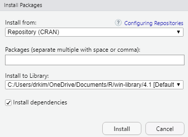

# R Scripts\index{R script} and R Packages\index{Packages}

## Objectives

In this chapter, we would like to users 

-   to write simple R scripts
-   to understand R packages
-   to install R packages
-   to create a new RStudio project
-   to be able to use RStudio Cloud

## Introduction

An R script is simply **a text file containing (almost) the same commands that you would enter on the command line of R**. ( almost) refers to the fact that if you are using sink() to send the output to a file, you will have to enclose some commands in print() to get the same output as on the command line.

R packages are **extensions to the R statistical programming language**. R packages contain code, data, and documentation in a standardised collection format that can be installed by users of R, typically via a centralised software repository such as CRAN (the Comprehensive R Archive Network).

## Open a new R script\index{R script}

For beginner, you may start by writing some simple codes. Since these codes are written in R language, we call these codes as R scripts\index{R script}. To do this, go to **File**, then click **R Script**

-   File -\> R Script\index{R script}
-   In Window OS, users can use this shortcut CTRL-SHIFT-N


### Our first R script\index{R script}

Let us write our very first R codes inside an R script\index{R script}.

-   In Line 1, type `2 + 3`
-   click CTRL-ENTER or CMD-ENTER
-   see the outputs in the Console Pane


```r
2 + 3
```

```
## [1] 5
```

After writing your codes inside the R script\index{R script}, you can save the R script\index{R script} file. This will allow you to open it up again to continue your work.

And to save R script\index{R script}, go to

-   File -\>
-   Save As -\>
-   Choose folder -\>\
-   Name the file

Now, types these codes to check the version of your R software


```r
version[6:7]
```

```
##        _
## status  
## major  4
```

The current version for R is 4.2.1

By they way if you are using lower version of R, then we recommend you to upgrade. To upgrade your R software

-   and if you are using Windows, you can use **installr** package
-   but if you use macOS, you may need to download R again and manually install

You may find more information from this [link](https://www.linkedin.com/pulse/3-methods-update-r-rstudio-windows-mac-woratana-ngarmtrakulchol/).

### Function, Argument and Parameters

R codes contain

-   function
-   argument
-   parameters

<!-- -->

    f <- function(<arguments>) {
    ## Do something interesting
    }

For example, to list all the arguments for a function, you may use `args()`. Let's examine the arguments for the function `lm()`, a function  to estimate parameters for linear regression model. 


```r
args(lm)
```

```
## function (formula, data, subset, weights, na.action, method = "qr", 
##     model = TRUE, x = FALSE, y = FALSE, qr = TRUE, singular.ok = TRUE, 
##     contrasts = NULL, offset, ...) 
## NULL
```

Once you understand the required arguments, you may use the parameters so the function can perform the desired task. For example:


```r
lm(weight ~ Time, data = ChickWeight)
```

```
## 
## Call:
## lm(formula = weight ~ Time, data = ChickWeight)
## 
## Coefficients:
## (Intercept)         Time  
##      27.467        8.803
```

### If users requires further help

If users would like to see more extensive guides on certain function, they may type the $?$ before the function. For example, users want to know more about the function `lm`, then he may type the R codes below. Following that, R will open a help page with more detailed description, usage of the function and the relevant arguments. 


```r
?lm
```

```
## starting httpd help server ... done
```

Here, we provide an example how a Help Pane\index{Help pane} will look like. 

{width="60%"}

## Packages\index{Packages}

R is a programming language. Furthermore, R software runs on packages\index{Packages}. R packages\index{Packages} are collections of functions and data sets developed by the community. They increase the power of R by improving existing base R codes and functions or by adding new ones.

A package is a suitable way to organize users' work and share it with others if users want to. Typically, a package will include

-   code (sometimes not just R codes but codes in other programming languages),
-   documentation for the package and the functions inside,
-   some tests to check that everything works as it should, and
-   data sets.

Users can read more about R packages\index{Packages} [here](https://www.datacamp.com/community/tutorials/r-packages-guide).

### Packages\index{Packages} on CRAN\index{Packages}

At the time of writing, the CRAN\index{CRAN} package repository features 12784 packages\index{Packages}. Available R packages are listed on the Cran Task Views\index{Task Views} website.

{width="60%"}

CRAN task views\index{Task Views} aim to provide some guidance which packages\index{Packages} on CRAN\index{CRAN} are relevant for tasks related to a certain topic. They give a brief overview of the included packages\index{Packages} and can be automatically installed using the **ctv** package. 

The views are intended to have a sharp focus so that it is sufficiently clear which packages\index{Packages} should be included (or excluded) and they are not meant to endorse the "best" packages\index{Packages} for a given task.

### Checking availability of R package 

To check if the desired package is available on users' machine, users can this inside their R console:


```r
library(tidyverse)
```

```
## ── Attaching core tidyverse packages ──────────────────────── tidyverse 2.0.0 ──
## ✔ dplyr     1.1.1     ✔ readr     2.1.4
## ✔ forcats   1.0.0     ✔ stringr   1.5.0
## ✔ ggplot2   3.4.2     ✔ tibble    3.2.1
## ✔ lubridate 1.9.2     ✔ tidyr     1.3.0
## ✔ purrr     1.0.1     
## ── Conflicts ────────────────────────────────────────── tidyverse_conflicts() ──
## ✖ dplyr::filter() masks stats::filter()
## ✖ dplyr::lag()    masks stats::lag()
## ℹ Use the conflicted package (<http://conflicted.r-lib.org/>) to force all conflicts to become errors
```


Users should not receive any error messages. Users who have not installed the package will receive an error message. Furthermore, it tells them that the package is not available in their R. By default, the package is stored in the R folder in their My Document or HOME directory


```r
.libPaths()
```

```
## [1] "C:/Users/drkim/AppData/Local/R/win-library/4.2"
## [2] "C:/Program Files/R/R-4.2.3/library"
```

### Install an R package\index{Packages}

To install an R package\index{Packages}, there are two ways:

1.  users can type the R codes like below (without the \# tag)


```r
# install.packages(tidyverse, dependencies = TRUE)
```

2.  users can use the GUI\index{GUI} in the RStudio IDE

{width="60%"}

Now, type the package\index{Packages} you want to install. For example you want to install the **tidyverse**\index{tidyverse} package

{width="60%"}

And then click the `Install` button. And you need to have internet access to do this. You can also install packages\index{Packages} from:

-   a zip file (from your machine or USB),
-   from github repository\index{GitHub repository}
-   other repository

## Working directory

Setting and knowing the R working directory\index{Working directory} is very important. Our working directory\index{Working directory} will contain the R codes, the R outputs, datasets or even resources or tutorials that can help us during in R project or during our R analysis/

The working directory\index{Working directory} is just a folder. Moreover, the folder can contain many sub-folders. We recommend that the folder contain the dataset (if you want to analyze your data locally) and other R objects. R will store many other R objects created during each R session.

Type this to locate the working directory:


```r
getwd()
```

```
## [1] "C:/Users/drkim/OneDrive - Universiti Sains Malaysia/multivar_data_analysis"
```

### Starting a new R job

There are two ways to start a new R job:

-   create a new R project from RStudio IDE\index{RStudio IDE}. This is the method that we recommend.
-   setting your working directory using the `setwd()` function.

### Creating a new R project\index{New project}

We highly encourage users to create a new R project. To do this users can 

-   go to `File -> New Project`

{width="60%"}

When you see project type, click New Project\index{New project}

{width="60%"}

### Location for dataset

Many data analysts use data stored on their local machines. R will read data and usually store this data in data frame format or class. When you read your data into RStudio\index{RStudio}, you will see the dataset in the environment pane. RStudio\index{RStudio} reads the original dataset and saves it to the RAM (random access memory). So you must know the size of your computer RAM. How much your RAM for your machine? The bigger the RAM, the larger R can read and store your data in the computer's memory.

The data read (in memory) will disappear once you close RStudio\index{RStudio}. But the source dataset will stay in its original location, so there will be no change to your original data (be happy!) unless you save the data frame in the memory and replace the original file. However, we do not recommend you do this.

{width="60%"}

## Upload data to RStudio Cloud\index{RStudio cloud}

If users want to use data in the RStuio Cloud, they may have to upload the data to the RStudio Cloud\index{RStudio cloud} directory. They may also use RStudio Cloud to read data from the `Dropbox` folder or `Google Drive` folder.

{width="60%"}

## More resources on RStudio Cloud\index{RStudio cloud}

There are a number of resources on RStudio Cloud\index{RStudio cloud}. For example, on YouTube channel, there is RStudio Cloud\index{RStudio cloud} for Education <https://www.youtube.com/watch?v=PviVimazpz8>. Another good resource on YouTube is `Working with R in Cloud` <https://www.youtube.com/watch?v=SFpzr21Pavg>

## Guidance and helps

To see further guidance and help, users may register and join RStudio Community at [RStudio Community](https://community.rstudio.com/). Users can also ask questions on [Stack Overflow](https://stackoverflow.com/). There are also mailing list groups on specific topics but users have to subscribe to it. 


## Bookdown

RStudio has provided a website to host online books, the [Bookdown](https://bookdown.org/). Th books at Bookdown\index{Bookdown}  are freely accessible onlineand some of the books are available on Amazon or other book depository as physical books. +

{width="60%"}

## Summary

In this chapter, we describe R scripts and R packages. We also show how to write simple R scripts and how to check if any specific R package is available on your machine and how to install it if it is not available. We recommend using RStudio Cloud if you are very new to R. Working directory sometimes confuses new R users, hence we also recommend all R users to create new RStudio Project for new analysis task. There are resources available offline and online and many of them are freely accessible especially at the `bookdown` website.  
