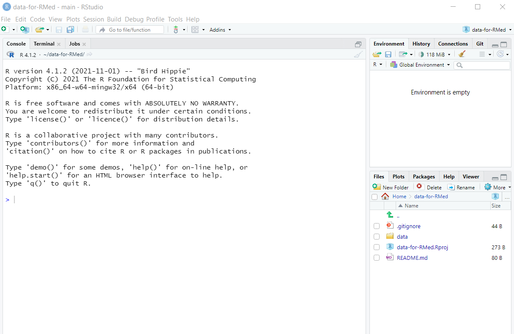

# RStudio Project

In this chapter, we will guide readers to have a similar folder and file structure. This will help readers to run the codes with minimal risk for errors. And we do this by creating RStudio Project. 

From the RStudio Project webpage https://support.rstudio.com/hc/en-us/articles/200526207-Using-RStudio-Projects , it says that RStudio projects make it straightforward to divide your work into multiple contexts, each with their own working directory, workspace, history, and source documents.RStudio projects are associated with R working directories. You can create an RStudio project:

- on RStudio Cloud or RStudio on your local machine
- In a brand new directory
- In an existing directory where you already have R code and data
- By cloning a version control (Git or Subversion) repository

## Objectives

The objectives of the chapters are

- to share the link for the dataset repository on GitHub
- to teach readers to create a RStudio Cloud project based on the dataset repository on GitHub
- to teach readers to create a RStudio project on local machine based on the dataset repository on GitHub

## Dataset repository on GitHub

We will use the our book repository on GitHub. The repository is `data-for-RMed`. To go to the repository, click on this link 

## RStudio project on RStudio Cloud

Head to RStudio Cloud page

Login to RStudio Cloud using your credentials

Once inside your workspace, click New Project

And click on `New Project from Git Repository`

You will got back to our `data-for-RMed` repository on GitHub. And you will click on `Clone` and click the copy button for HTTPS

 

Next, we will clone the repository on our RStudio Cloud. This will ensure the file structure is the same with that of on the RStudio Cloud. Following that, just click OK.

A new Rstudio Cloud project will be created.

## RStudio project on local machine

If you want to create a new project on your local machine using the same GitHub repository, then follow these steps.

First, open the RStudio.

On the menu, click `File`, then click `New Project`

 

Then click `Project` and then `Version Control`

and then click `Git`

And remember the HTTPS that we have copied from our `dataset-for-RMed` GitHub repository

Now, 

- paste the HTTPS link 
- the Project directory name will be automatically filled
- Click on `Browse`, and you may choose whichever folder that you prefer. We recommend you to use home directory (such as `Documents`)

And now RStudio will create a new working directory on your local machine. This working directory contains the same folder and file structures with the GitHub repository

