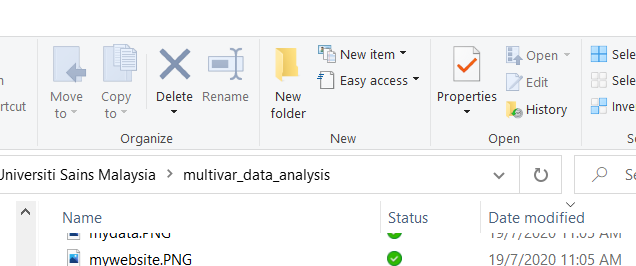

# Data Visualization

## Introduction

Data visualization is viewed by many disciplines as a modern equivalent of visual communication. It involves the creation and study of the visual representation of data. Data visualization requires "information that has been abstracted in some schematic form, including attributes or variables for the units of information". You can read more about data visualization [here](https://en.m.wikipedia.org/wiki/Data_visualization) and [here](https://en.m.wikipedia.org/wiki/Michael_Friendly)

## Objectives

In this chapter, readers will:

- be introduced to the concept of data visualization
- be able to understand ingredients for good graphics
- be able to generate plots using **ggplot** packages
- be able to save plots in different formats and graphical settings

## History and objectives of data visualization

In his 1983 book which carried the title *The Visual Display of Quantitative Information*, the author Edward Tufte defines **graphical displays** and principles for effective graphical display. The book mentioned that "Excellence in statistical graphics consists of complex ideas communicated with clarity, precision and efficiency."

Visualization is the process of representing data graphically and interacting with these representations. The objective is to gain insight into the data. Some of the processes are outlined on Watson IBM [webpage](http://researcher.watson.ibm.com/researcher/view_group.php?id=143)

## Ingredients for good graphics

Good graphics are important to convey the message from your data visually. They will complement the text for your books, reports or manuscripts. However, you need to make sure that while writing codes for graphics, you need to consider these ingredients:

-   You have good data
-   Priorities on substance rather than methodology, graphic design, the technology of graphic production or something else
-   Do not distort what the data has to say
-   Show presence of many numbers in a small space
-   Coherence for large data sets
-   Encourage the eye to compare different pieces of data
-   Graphics reveal data at several levels of detail, from a broad overview to the fine structure
-   Graphics serve a reasonably clear purpose: description, exploration, tabulation or decoration
-   Be closely integrated with the statistical and verbal descriptions of a data set.

## Graphics packages in R

There are a number of packages to create graphics in R. They include packages that perform general data visualization or graphical tasks. The others provide specific graphics for certain statistical or data analyses.

The popular general purpose graphics packages in R include:

-   **graphics**\index{graphics} : a base R package, which means it is loaded every time we open R
-   **ggplot2**\index{ggplot2} : a user-contributed package by RStudio, so you have to install it the first time you are using it. It is a standalone package but also comes together with **tidyverse** package
-   **lattice**\index{lattice} : This is a user-contributed package. It provides the ability to display multivariate relationships and it improves on the base-R graphics. This package supports the creation of trellis graphs: graphs that display a variable or.

A few examples more specific graphical packages include:

-   **survminer** : The **survminer**\index{survminer} R package provides functions for facilitating survival analysis and visualization. It contains the function `ggsurvplot()` for drawing easily beautiful and ready-to-publish survival curves with the *number at risk* table and *censoring count plot*.
-   **sjPlot**\index{sjPlot} : Collection of plotting and table output functions for data visualization. You can plot results of various statistical analyses including simple and cross tabulated frequencies, histograms, box plots, (generalized) linear models, mixed effects models, principal component analysis and correlation matrices, cluster analyses, scatter plots, stacked scales, effects plots of regression models (including interaction terms).

Except for **graphics**\index{graphics} package (a base R package), other packages such as **ggplot2** and **lattice** need to be installed into your R library if you want to use them for the first time.

## The **ggplot2**\index{ggplot2} Package

For this book, we will focus on using the **ggplot2**\index{ggplot2} package. The **ggplot2**\index{ggplot2} package is an elegant, easy and versatile general graphics package in R. It implements the **grammar of graphics**\index{Grammar of graphics} concept. The advantage of this concept is that, it fasten the process of learning graphics. It also facilitates the process of creating complex graphics

To work with **ggplot2**\index{ggplot2}, remember that at least your R codes must

-   start with `ggplot()`
-   identify which data to plot `data = Your Data`
-   state variables to plot for example `aes(x = Variable on x-axis, y = Variable on y-axis )` for bivariate
-   choose type of graph, for example `geom_histogram()` for histogram, and `geom_points()` for scatterplots\index{Scatterplot}

The official website for ggplot2\index{ggplot2} is here <https://ggplot2.tidyverse.org/> which is an excellent resource. The website states that *ggplot2*\index{ggplot2} is a plotting system for R, based on the grammar of graphics\index{Grammar of graphics}, which tries to take the good parts of base and lattice\index{lattice} graphics and none of the bad parts. It takes care of many of the fiddly details that make plotting a hassle (like drawing legends) as well as providing a powerful model of graphics that makes it easy to produce complex multi-layered graphics.

## Preparation

### Create a New RStudio Project

We always recommended that whenever users want to start working on a new data analysis project in RStudio, they should create a new R project.

-   Go to `File`,
-   click `New Project`.

If you want to create a new R project using an existing folder, then choose this folder directory when requested in the `existing Directory` in the `New Project Wizard` window. Using an R project directory is useful because RStudio will store and save your codes and outputs in that directory (folder).

If you do not want to create a new project, then make sure you are inside the correct directory (R call this as working directory). The working directory is a folder where you store your codes and outputs. If you want to locate your working directiry, type `getwd()` in your Console.

Inside your working directory,

-   we recommend you keep your dataset and your codes codes (R scripts `.R`, R markdown files `.Rmd`\index{R markdown})
-   RStudio will store your outputs

### Important questions before plotting graphs

You must ask yourselves these:

-   Which variable or variables do you want to plot?
-   What is (or are) the type of that variable?
    -   Are they factor (categorical) variables or numerical variables?
-   Am I going to plot
    -   a single variable?
    -   two variables together?\
    -   three variables together?

## Read Data

R can read almost all (if not all) types of data. The common data formats in data and statistical analysis include

-   comma separated files (`.csv`)
-   MS Excel file (`.xlsx`)
-   SPSS\index{SPSS} file (`.sav`)
-   Stata\index{STATA} file (`.dta`)
-   SAS\index{SAS} file

However, you need user-contributed packages to read data from statistical software. For example. **haven**\index{haven} and **rio**\index{rio} packages.

Below we show are the functions to read SAS\index{SAS}, SPSS\index{SPSS} and Stata\index{STATA} file using the **haven**\index{haven} package.

1.  SAS\index{SAS}: `read_sas()` reads .sas7bdat + .sas7bcat files and read_xpt() reads SAS\index{SAS} transport files (version 5 and version 8). write_sas() writes .sas7bdat files.
2.  SPSS\index{SPSS}: `read_sav()` reads .sav files and read_por() reads the older .por files. write_sav() writes .sav files.
3.  Stata\index{STATA}: `read_dta()` reads .dta files (up to version 15). write_dta() writes .dta files (versions 8-15).

Sometime, users may want to analyse data stored databases. Some examples of common databases format are:

1.  MySQL
2.  SQLite
3.  Postgresql
4.  MariaDB

To read data from databases, you must connect your RStudio IDE with the database. There is an excellent resource to do this on the *Databases Using R* [webpage](https://solutions.rstudio.com/db/)

## Load the packages

The **ggplot2**\index{ggplot2} package is one of the core member of **tidyverse**\index{tidyverse} metapackage (<https://www.tidyverse.org/>). So, whenever we load the **tidyverse**\index{tidyverse} package, we automatically load other packages inside the **tidyverse**\index{tidyverse} metapackage. These packages include **dplyr**\index{dplyr}, **readr**\index{readr}, and of course **ggplot2**\index{ggplot2}.

Loading a package will give you access to

1.  help pages of the package
2.  functions available in the package
3.  sample datasets (not all packages contain this feature)

In the example below, we also load the **here**\index{here} package. This package is useful to point R codes to the specific folder of an R project direcroty. We will see this in action later.

```{r}
library(tidyverse)
library(here)
```

If you run the `library()` code and then you get this message *there is no package called tidyverse*\index{tidyverse}, it means the package is still not available in your R library. So, you need to install the missing package. Similarly, if you receive the error message while loading the **tidyverse**\index{tidyverse} package, it means you need to install it.

To install an R package for example **tidyverse**, type `install.package("tidyverse")`\index{tidyverse} in the Console. Once the installation is complete, type `library(tidyverse)`\index{tidyverse} again to load the package. Alternatively, you can use the GUI\index{GUI} to install the package.

{width="60%"}

Now, type the package you want to install. For example if you want to install the **tidyverse**\index{tidyverse} package, then type the name in the box.

{width="60%"}

## Read dataset

In this chapter, we will use two datasets, the `gapminder` dataset and a peptic ulcer dataset. The `gapminder` dataset is a built-in dataset in the **gapminder**\index{gapminder} package. You can read more about *gapminder*\index{gapminder} from <https://www.gapminder.org/> webpage. The gapminder\index{gapminder} website contains many useful datasets and show wonderful graphics, made popular by the late Dr Hans Rosling.

To load the **gapminder**\index{gapminder} package, type:

```{r}
library(gapminder)
```

Next, we will call the data *gapminder* into R. Then , we will browse the first six observations of the data. The codes below:

-   assigns gapminder as a dataset
-   contains a pipe `%>%` that connects two codes (`gapminder` and `slice`)
-   contains a function called `slice()` that selects rows of the dataset

```{r}
gapminder <- gapminder
gapminder %>% 
  slice(1:4)
```

It is a good idea to quickly list the variables of the dataset and look at the type of each of the variables:

```{r}
glimpse(gapminder)
```

We can see that the *gapminder* dataset has:

-   six (6) variables
-   a total of 1704 observations
-   tTwo factor variables, 2 integer variables and 2 numeric (`dbl`) variables

We can generate some basic statistics of the gapminder datasets by using `summary()`. This function will list

-   the frequencies
-   central tendencies and dispersion such as min, 1st quartile, median, mean, 3rd quartile and max

```{r}
summary(gapminder)
```

## Basic plots\index{Basic plots}

Let us start by creating a simple plot using these arguments:

-   data : `data = gapminder`
-   variables : `x = year`, `y =  lifeExp`
-   graph scatterplot\index{Scatterplot} : `geom_point()`

**ggplot2**\index{ggplot2} uses the $+$ sign to connect between functions, including **ggplot2** functions that span multiple lines.

```{r ,out.width='60%'}
ggplot(data = gapminder) +
  geom_point(mapping = aes(x = year, y = lifeExp))
```

From the plot, we can see

-   a scatterplot\index{Scatterplot}
-   the scatterplot\index{Scatterplot} shows the relationship between `year` and `life expectancy`.
-   as variable year advances, the life expectancy increases.

If you look closely, you will notice that

-   `ggplot()` function tells R to be ready to make plot from a specified data.
-   `geom_point()` function tells R to make a scatter plot.

Users may find more resources about **ggplot2**\index{ggplot2} package on the **ggplot2** [webpage](https://ggplot2.tidyverse.org/reference/ggplot.html) [@R-ggplot2]. Other excellent resources include the online [R Graphics Cookbook](https://r-graphics.org/) and its physical book [@chang2013r] .

## More complex plots

### Adding another variable

We can see that the variables we want to plot are specified by `aes()`. We can add a third variable to make a more complex plot. For example:

-   data : `data = gapminder`
-   variables : `x = year`, `y = lifeExp`, `colour = continent`

The objective to create plot using multiple (more than two variable) is to enable users to visualize more complex relationship between the more than two variables. Let's take an example a visualization for variable `year`, variable `life expectancy` and variable `continent`.

```{r ,out.width='60%'}
ggplot(data = gapminder) +
  geom_point(mapping = aes(x = year, 
                           y = lifeExp, 
                           colour = continent))

```

From the scatterplot\index{Scatterplot} of these three variables, you may notice that

-   European countries have high life expectancy
-   African countries have lower life expectancy
-   One country is Asia looks like an outlier (very low life expectancy)
-   One country in Africa looks like an outlier too (very low life expectancy)

Now, we will replace the third variable with Gross Domestic Product `gdpPercap` and correlates it with the size of `gdpPerCap`.

```{r ,out.width='60%'}
ggplot(data = gapminder) +
  geom_point(mapping = aes(x = year, 
                           y = lifeExp, 
                           size = gdpPercap))

```

You will notice that *ggplot2*\index{ggplot2} automatically assigns a unique level of the aesthetic (here a unique color) to each value of the variable, a process known as scaling. *ggplot2*\index{ggplot2} also adds a legend that explains which levels correspond to which values. The plot suggests that with higher `gdpPerCap`, there is also longer `lifeExp`.

Instead of using colour, we can also use different shapes. Different shapes are useful especially in the instances where there is no facility to print out colourful plots.

```{r ,out.width='60%'}
ggplot(data = gapminder) +
  geom_point(mapping = aes(x = year, 
                           y = lifeExp, 
                           shape = continent))

```

You may end creating a different colour plot if you specify the colour outside the `aes` parentheses. For example, let set the parameter colour to `blue`:

```{r ,out.width='60%'}
ggplot(data = gapminder) +
  geom_point(mapping = aes(x = year, y = lifeExp), 
             colour = 'blue')

```

To change the parameter shape, for example to plus, you can set the argument for `shape` to equal `3`.

```{r ,out.width='60%'}
ggplot(data = gapminder) +
  geom_point(mapping = aes(x = year, y = lifeExp), 
             shape = 3)

```

You may be interested to know what number corresponds to what type of shape. To do so, you can type `?pch` to access the help document. You will see in the Viewer pane, there will be a document that explains various shapes available in R. It also shows what number that represent each shape.

### Making subplots

You can split our plots based on a factor variable and make subplots using the `facet()`. For example, if we want to make subplots based on continents, then we need to set these parameters:

-   data = gapminder
-   variable `year` on the x-axis and `lifeExp` on the y-axis
-   split the plot based on continent
-   set the number of rows for the plot at 3

```{r ,out.width='60%'}
ggplot(data = gapminder) +
  geom_point(mapping = aes(x = year, y = lifeExp)) + 
  facet_wrap(~ continent, nrow = 3)
```

However, you will get a different arrangement of plot if you change the value for the `nrow`

```{r ,out.width='60%'}
ggplot(data = gapminder) +
  geom_point(mapping = aes(x = year, y = lifeExp)) + 
  facet_wrap(~ continent, nrow = 2)
```

### Overlaying plots

Each `geom_X()` in ggplot2\index{ggplot2} indicates different visual objects. This is a scatterplot\index{Scatterplot}:

```{r ,out.width='60%'}
ggplot(data = gapminder) +
  geom_point(mapping = aes(x = gdpPercap, y = lifeExp))
```

This is a smooth line plot\index{Line plot}:

```{r ,out.width='60%'}
ggplot(data = gapminder) +
  geom_smooth(mapping = aes(x = gdpPercap, y = lifeExp))
```

Let's generate a smooth plot based on continent using the `linetype()` and use `log(gdpPercap)` to reduce the skewness of the data. Use these codes:

```{r ,out.width='60%'}
ggplot(data = gapminder) +
  geom_smooth(mapping = aes(x = log(gdpPercap), 
                            y = lifeExp, 
                            linetype = continent))
```

Another smooth plot but setting the parameter for colour:

```{r ,out.width='60%'}
ggplot(data = gapminder) +
  geom_smooth(mapping = aes(x = log(gdpPercap), 
                            y = lifeExp, 
                            colour = continent))
```

### Combining different plots

We can combine more than one `geoms` (type of plots) to overlay plots. The trick is to use multiple `geoms` in a single line of R code:

```{r ,out.width='60%'}
ggplot(data = gapminder) +
  geom_point(mapping = aes(x = log(gdpPercap), y = lifeExp)) +
  geom_smooth(mapping = aes(x = log(gdpPercap), y = lifeExp))
```

The codes above show duplication or repetition. To avoid this, we can pass the mapping to `ggplot()`:

```{r ,out.width='60%'}
ggplot(data = gapminder, 
       mapping = aes(x = log(gdpPercap), y = lifeExp)) +
  geom_point() +
  geom_smooth()
```

And we can expand this to make scatterplot\index{Scatterplot} shows different colour for continent:

```{r ,out.width='60%'}
ggplot(data = gapminder, 
       mapping = aes(x = log(gdpPercap), y = lifeExp)) +
  geom_point(mapping = aes(colour = continent)) +
  geom_smooth()
```

Or expand this to make the smooth plot shows different colour for continent:

```{r ,out.width='60%'}
ggplot(data = gapminder, 
       mapping = aes(x = log(gdpPercap), y = lifeExp)) +
  geom_point() +
  geom_smooth(mapping = aes(colour = continent))
```

Or both the scatterplot and the smoothplot:

```{r ,out.width='60%'}
ggplot(data = gapminder, 
       mapping = aes(x = log(gdpPercap), y = lifeExp)) +
  geom_point(mapping = aes(shape = continent)) +
  geom_smooth(mapping = aes(colour = continent))

```

### Statistical transformation

Let us create a Bar chart\index{Bar chart}, with y axis as the frequency.

```{r ,out.width='60%'}
ggplot(data = gapminder) +
  geom_bar(mapping = aes(x = continent))
```

If we want the y-axis to show proportion, we can use these codes

```{r ,out.width='60%'}
ggplot(data = gapminder) +
  geom_bar(mapping = aes(x = continent, y = ..prop..,
                         group = 1))
```

### Customizing title

We can customize many aspects of the plot using ggplot package. For example, from gapminder dataset, we choose `gdpPerCap` and log it (to reduce skewness) and `lifeExp`, and make a scatterplot.

Let's name the plot as `mypop`

```{r ,out.width='60%'}
mypop <- ggplot(data = gapminder, 
                mapping = aes(x = log(gdpPercap), 
                              y = lifeExp)) +
  geom_point() +
  geom_smooth(mapping = aes(colour = continent))
mypop
```

You will notice that there is no title in the plot, so now you want to add the title:

```{r ,out.width='60%'}
mypop + 
  ggtitle("GDP (in log) and life expectancy")
```

To make the title appear in multiple lines, we can add `\n`:

```{r ,out.width='60%'}
mypop + ggtitle("GDP (in log) and life expectancy:
                \nData from Gapminder")
```

### Adjusting axes

We can specify the tick marks

-   min = 0
-   max = 12
-   interval = 1

```{r ,out.width='60%'}
mypop + 
  scale_x_continuous(breaks = seq(0,12,1))
```

And we can label the x-axis and y-axis:

```{r ,out.width='60%'}
mypop + 
  ggtitle("GDP (in log) and life expectancy:
                \nData from Gapminder") + 
  ylab("Life Expentancy") + 
  xlab("Percapita GDP in log")
```

### Choosing themes

The default is gray theme or `theme_gray()`. But there are many other themes. One of the popular themes is the the black and white theme and the classic theme:

```{r ,out.width='60%'}
mypop + 
  theme_bw()
```

```{r ,out.width='60%'}
mypop + 
  theme_classic()
```

## Saving plots\index{Saving plots}

In R, you can save the plot into different graphical format. You can also set other parameters such as the `dpi` and the size for the plot (height and width). One of the preferred formats for saving a plot is as a PDF format.

Here, we will show how to save plots in different format in R. In this example, let us use the object we created before (`mypop`). We will add

-   title
-   x label
-   y label
-   classic theme

And then create a new graphical object `myplot`

```{r ,out.width='60%'}
myplot <- 
  mypop + 
  ggtitle("GDP (in log) and life expectancy:
                \nData from Gapminder") + 
  ylab("Life Expentancy") + 
  xlab("Percapita GDP in log") +
  scale_x_continuous(breaks = seq(0,12,1)) +
  theme_classic()
myplot
```

We now can see a nice plot. And next, we want to save the plot (currently on the screen) to these formats:

-   `pdf` format
-   `png` format
-   `jpg` format

And we want to save the plots in a folder named as `plots`. To do this

-   create a folder and name it as `plot`

{width="60%"}

{width="60%"}

We are using the `here()` function now. If you notice, we use a new package called **here**\index{here}. This is a very useful package that can help get or save files in the correct path (including folder) even when we are using different machines. If we are not clear about this, do you remember any circumstances when the drive name changes automatically (especially when using thumb drive) in different computers. By using `here()` from the **here**\index{here} package, we will always get to the correct path or folder.

To save the plots in the directory named as plots, we can do these:

```{r}
ggsave(plot = myplot, 
       here("plots","my_pdf_plot.pdf"))
ggsave(plot = myplot, 
       here("plots","my_png_plot.png")) 
ggsave(plot = myplot, 
       here("plots","my_jpg_plot.jpg"))
```

**ggplot2** is flexible and contains many customizations. For example, we want to set these parameters to our plots:

1.  width = 10 cm (or you can use `in` for inches)
2.  height = 6 cm (or you can use `in` for inches)
3.  dpi = 150. `dpi` is dots per inch

```{r}
ggsave(plot = myplot, 
       here('plots','my_pdf_plot2.pdf'), 
       width = 10, height = 6, units = "in",
       dpi = 150, device = 'pdf')
ggsave(plot = myplot, 
       here('plots','my_png_plot2.png'), 
       width = 10, height = 6, units = "cm", 
       dpi = 150, device = 'png')
ggsave(plot = myplot, 
       here("plots","my_jpg_plot2.jpg"), 
       width = 10, height = 6, units = "cm",
       dpi = 150, device = 'jpg')
```

## Summary

In this chapter, we briefly describe important matters before making plots. Then we teach readers to make plots using the **ggplot2** package. This package uses the principle of Grammar for Graphics to ensure the codes are more intuitive. Readers learn to generate simple plot for one variable before moving on to plot two and three variables simultaneously. **ggplot2** is also flexible and contains many customizations to help readers generate wonderful plots and how to save them.
