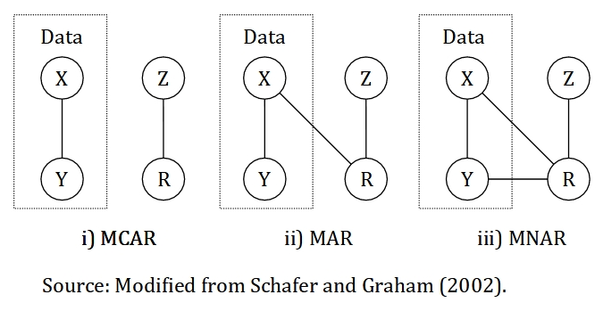

# Introduction to Missing Data Analysis

## Objectives

At the end of the chapter, readers will be able to:

- To perform a simple imputation\index{Simple imputation}
- To perform a single imputation\index{Single imputation}
- To perform a multiple imputation

## Introduction

Missing data can significantly affect the performance of predictive risk modeling, an important technique for developing medical guidelines. The two most commonly used strategies for managing missing data are to impute or delete values, and the former can cause bias, while the later can cause both bias and loss of statistical power. Several techniques designed to deal with missing data are described and applied to an illustrative example. These methods include complete-case analysis, available-case analysis, as well as single and multiple imputation.

Researchers should report the details of missing data, and appropriate methods for dealing with missing values should be incorporated into the data analysis.

## Types of missing data

Missing data\index{Missing data} data is quite a common issue in research. The causes of missing data should always be investigated and more data should be collected if possible. There are three types of missing data:

1. Missing completely at random (MCAR\index{MCAR})
2. Missing at random (MAR\index{MAR})
3. Missing not at random (MNAR\index{MNAR})

```{r NAtype, out.width="65%", echo=FALSE, fig.cap="Illustration of missing data mechanism for the three types of missing data. The data is made up of X and Y. X represents a variable with completely observed values, Y represents a variable with missing values, Z represents a cause of missing values and R represents an indicator variable that identify missing and observed values in Y, in other words, the missingness."}

```

Missing data is classified as MCAR\index{MCAR} if the missingness is unrelated to the data. For example, medical records that is lost due to flood and laboratory equipment malfunction, *Z*. In other words, the data is missing totally by chance. We can relate this example to the Figure \@ref(fig:NAtype), the missingness, *R* is not related to the data itself, which is a combination of variables with completely observed values, *X* and variables with partly missing values, *Y*. MCAR\index{MCAR} is ideal and more convenient, though MAR\index{MAR} is more common and realistic.

Missing data is said to be MAR\index{MAR} if the missingness is related to other values that we completely observed, but not to the variable with missing values itself. For example, an older person is more likely to complete a survey compared to the younger person. So, the missingness is related to age, a variable that has been observed in the data. Similarly, if information on income is more likely to be missing for older individuals as they are more cautious to reveal a sensitive information as opposed to younger individuals. Thus, the missingness is related to age, which should be a variable that we have collected during the survey. The similarity of the two examples is that we completely observed the variable age. Another example of MAR\index{MAR} is missing a certain variable due to the old medical form do not include this information in the form. However, a new updated medical form include this information. As the missingness is not related to the variable with missing values itself and we have the information whether the patients use an old or a new medical form, we can classify this missingness as MAR\index{MAR}. We can see from all the examples that the missingness, *R* is related to other variables that we completely observed, *X*, but not to the variable with missing values itself, *Y* as illustrated in the Figure \@ref(fig:NAtype).

Lastly, the missing data is considered MNAR\index{MNAR} if the missingness is related to the variable with missing values itself and other variables with completely observed values as well. Also, the missingness is considered MNAR\index{MNAR} if the causes completely unknown to us. In other words, we can not logically deduce that the missing data fit MCAR\index{MCAR} or MAR\index{MAR} types. For example, missing a weight information for an obese individuals as the normal weighing scale may not able to weigh the individuals. Thus, according to \@ref(fig:NAtype), the pattern of missingness is considered MNAR\index{MNAR} as the missingness, *R* is related the variable with partly missing values itself, *Y*. However, we can never be sure of this without a further investigation about the mechanism of missingness and its causes. MNAR\index{MNAR} is the most problematic type among the three. There are a few approaches to differentiate between MCAR\index{MCAR} and MAR-MNAR. However, an approach to differentiate between MAR\index{MAR} and MNAR\index{MNAR} has yet to be proposed. Thus, we need to use a logical reasoning to differentiate between the two types.

Alternatively, Figure \@ref(fig:NAtype) can be represented mathematically as follows:

$$MCAR: P(R|Z)$$
$$MAR: P(R|X,Z)$$
$$MNAR: P(R|X,Y,Z)$$
In MCAR, the missingness is completely related to the cause of missing data, *Z*, which is unrelated to variables with completely observed values, *X* and variables with missing values, *Y*. However, MAR allows the missingness to be related to *X*, on top of *Z*. Additionally, MNAR requires the missingness related to *X*, *Y*, and *Z*.


## Preliminaries

### Packages

We will use these packages:

- **mice**\index{mice}: for the single and multiple imputation
- **VIM**\index{VIM}: for missing data exploration
- **naniar**\index{naniar}: for missing data exploration
- **tidyverse**\index{tidyverse}: for data wrangling and manipulation
- **gtsummary**\index{gtsummary}: to provide a nice result in a table

```{r, warning=FALSE, message=FALSE}
library(mice)
library(VIM)
library(naniar)
library(tidyverse)
library(gtsummary)
```

### Dataset

We going to use the coronary dataset that we used previously in linear regression chapter. However, this dataset have been altered to generate a missing values in it.

```{r, message=FALSE, warning=FALSE}
coroNA <- read_csv(here::here('data', "coronaryNA.csv"))
```

Next, we going to transform the all the character variables into a factor. `mutate_if()` will recognise all character variables and transform it into a factor.

```{r}
coroNA <- 
  coroNA %>% 
  mutate_if(is.character, as.factor)
summary(coroNA)
```

Missing data in R is denoted by `NA`. Further information about `NA` can be assessed by typing `?NA` in the RStudio console. As seen above, the three variables; age, race and chol have missing values. We can further confirm this using a `anyNA()`.

```{r}
anyNA(coroNA)
```

True indicates a presence of missing values in our data. Thus, we can further explore the missing values in our data.

## Exploring missing data

The total percentage of missing values in our data is 10.7%.

```{r}
prop_miss(coroNA)
```

Percentage of missing data by variable:

```{r}
miss_var_summary(coroNA)
```

Both `prop_miss()` and `miss_var_summary()` are from `naniar` package\index{naniar}. Subsequently, We can explore the pattern of missing data using `aggr()` function from `VIM`\index{VIM}. The `numbers` and `prop` arguments indicate that we want the missing information on the y-axis of the plot to be in number not proportion.

```{r}
aggr(coroNA, numbers = TRUE, prop = FALSE)
```

The labels on x-axis are according to the column names in the dataset. In term of pattern of missingness\index{Pattern of missingness}, about 43 observation are missing age values alone.

Similarly, the pattern of missing data can be explore through `md.pattern()` from `mice`\index{mice} package. The `plot` argument is set to `FALSE` since the plot is reflective of the pattern of missing data matrix below. To see the plot, the `plot` argument should be set to `TRUE`.

```{r}
md.pattern(coroNA, plot = FALSE)
```

Additionally, we can assess the correlation:

1. Between variables with missing values
2. Between variables with missing values and variable with non-missing values

First, we need to take variables with missing values only. Then, we code a missing value with 1 and non-missing value with 0.

```{r}
dummyNA <- 
  as.data.frame(abs(is.na(coroNA))) %>% 
  select(age, race, chol) # pick variable with missing values only
head(dummyNA)
```

We assess the correlation between variables with missing values.

```{r}
cor(dummyNA) %>% round(digits = 2)
```

There is no strong correlation between variables with missing values. We can conclude that the missing values in one variable is not related to the missing values in another variable.

The second correlation is between variables with missing values and variable with non-missing values. First, we need to change the categorical variable into a numeric value to get a correlation for all the variables.

```{r}
cor(coroNA %>% mutate_if(is.factor, as.numeric), 
    dummyNA, use = "pairwise.complete.obs") %>% 
  round(digits = 2)
```

We can safely ignore the warning generated in the result. Variables on the left side are variable with non-missing values and variables on the top of the columns are variables with missing values. There is a high correlation (-0.76) between bmi and chol indicating values of chol are more likely to be missing at lower values of bmi.

Lastly, we can do a Little's test to determine if the missing data is MCAR\index{MCAR} or other types. The null hypothesis is the missing data is MCAR\index{MCAR}. Thus, a higher p value indicates probability of missing data is MCAR\index{MCAR}. The test shows that the missingness in our data is either MAR\index{MAR} or MNAR\index{MNAR}.

```{r}
mcar_test(coroNA)
```

## Handling missing data

We going to cover four approaches to handling missing data:

1. Listwise deletion\index{Listwise deletion}
2. Simple imputation\index{Simple imputation}:
    + Mean substitution
    + Median substitution
    + Mode substitution
3. Single imputation\index{Single imputation}:
    + Regression imputation
    + Stochastic regression imputation
    + Decision tree imputation
4. Multiple imputation\index{Multiple imputation}

Each approach has their own caveats which we will cover in each section below.

### Listwise deletion\index{Listwise deletion}

Listwise or case deletion\index{Listwise deletion} is the default setting in R. By default, R will exclude all the rows with missing data.

```{r}
lw <- lm(dbp ~ ., data = coroNA)
summary(lw)
```

As shown in the information above (at the bottom), 136 rows or observations were excluded due to missingness. Listwise deletion\index{Listwise deletion} approach able to produce an unbiased result only when the missing data is MCAR\index{MCAR} and the amount of missing data is relatively small.

### Simple imputation\index{Simple imputation}

A simple imputation\index{Simple imputation} includes mean, median and mode substitution is a relatively easy approach. In this approach, the missing values is replaced by a mean or median for numerical variable, and mode for categorical variable. This simple imputation\index{Simple imputation} approach only appropriate if missing data is MCAR\index{MCAR} and the amount of missing data is relatively small.

1. Mean substitution

`replace_na` will replace the missing values in age with its mean.

```{r}
mean_sub <- 
  coroNA %>% 
  mutate(age = replace_na(age, mean(age, na.rm = T)))

summary(mean_sub)
```

2. Median substitution

`replace_na` will replace the missing values in age with its median.

```{r}
med_sub <- 
  coroNA %>% 
  mutate(age = replace_na(age, median(age, na.rm = T)))

summary(med_sub)
```

3. Mode substitution

We need to find the mode, the most frequent level or group in the variable. In race variable, it is malay.

```{r}
table(coroNA$race)
```

`replace_na` will replace the missing values in race with its mode.

```{r}
mode_sub <- 
  coroNA %>% 
  mutate(race = replace_na(race, "malay"))

summary(mode_sub)
```

### Single imputation\index{Single imputation}

In single imputation\index{Single imputation}, missing data is imputed by any methods producing a single set of a complete dataset. In facts, the simple imputation\index{Simple imputation} approaches (mean, median and mode) are part of single imputation\index{Single imputation} techniques. Single imputation\index{Single imputation} is better compared to the previous techniques that we have covered so far. This approach incorporate more information from other variables to impute the missing values. However, this approach produce a result with a small standard error, which reflect a false precision in the result. Additionally, a single imputation\index{Single imputation} approach do not take into account uncertainty about the missing data (except for stochastic regression imputation). Additionally, this approach is applicable if the missing data is at least MAR\index{MAR}.

1. Regression imputation

We will do a linear regression imputation for numerical variables (age and chol) and multinomial or polytomous logistic regression\index{Multinomial logistic regression} for categorical variable (since race has three levels; malay, chinese and indian).

We run `mice()` with `maxit = 0` (zero iteration) to get a model specification and further removed id variable as it is not useful for the analysis. Here, we do not actually run the imputation yet as the iteration is zero (`maxit = 0`).

```{r}
ini <- mice(coroNA %>% select(-id), m = 1, maxit = 0) 
ini
```

By default, `mice()` use predictive mean matching (pmm) for a numerical variable, binary logistic regression (logreg) for a categorical variable with two levels and multinomial or polytomous logistic regression (polyreg)\index{Multinomial logistic regression} for a categorical variable with more than two level. `mice()` will not assign any method for variable with non-missing values by default (denote by "" in the section of imputation method above).

We going to change the method for numerical variable (age and chol) to a linear regression.

```{r}
meth <- ini$method
meth[c(1,3)] <- "norm.predict"
meth
```

`mice()` function contains a few arguments:

- `m`: number of imputed sets (will be used in the multiple imputation\index{Multiple imputation} later)
- `method`: to specify a method of imputation
- `predictorMatrix`: to specify predictors for imputation
- `printFlag`: print history on the R console
- `seed`: random number for reproducibility

```{r}
regImp <- mice(coroNA %>% select(-id), 
               m = 1, method = meth, printFlag = F, seed = 123)
regImp
```

Here, we can see the summary of our imputation model:

1. Number of multiple imputation\index{Multiple imputation}
2. Imputation methods
3. PredictorMatrix

We can further assess the full predictor matrix from the model.

```{r}
regImp$predictorMatrix
```

The predictor matrix denotes the variable to be imputed at the left side and the predictors at the top of the column. 1 indicates a predictor while 0 zero indicates a non-predictor. This predictor matrix can be changed accordingly if needed by changing 1 to 0 (a predictor to a non-predictor) or vise versa. Noted that the diagonal is 0 as the variable is not allowed to impute itself.

As an example, to impute missing values in age, all of the variables are used as predictors except for age itself as shown in the predictor matrix. So, the outcome variable ($\hat{y}$) in linear regression equation will be the imputed variable.

$$
\hat{y} = \beta_0 + \beta_1x_1 + \beta_2x_2 + ... + \beta_kx_k
$$ 
So, the above equation for imputed age variable in the first row of the predictor matrix will be:

$$
age = \beta_0 + \beta_1(race) + \beta_2(chol) + \beta_3(cad) + \beta_4(sbp) + \beta_5(dbp) + 
$$ 
$$
\beta_6(bmi) + \beta_6(gender)
$$
Although it seems that we impute all the missing values in each variable simultaneously, in actuality each imputation model will run separately. So, in our data, on top of the imputation model for age, we have another imputation models for race and chol variables. Fortunately, we do not have to concern much about which variable to be used as a predictor as `mice()` will automatically select the useful predictors for each variables with missing values. Further information on how `mice` do this automatic selection can assessed by typing `quickpred()` in the RStudio console.

We can asses the imputed dataset as follows:

```{r}
coro_regImp <- complete(regImp, 1)
summary(coro_regImp)
```

2. Stochastic regression imputation

Stochastic regression imputation is an extension of regression imputation. This method attempts to account for the missing data uncertainty by adding a noise or extra variance. This method only applicable for numerical variable.

First, we get a model specification.

```{r}
ini <- mice(coroNA %>% select(-id), m = 1, maxit = 0) 
ini
```

Then, we specify the imputation method to stochastic regression (norm.nob) for all numerical variables with missing values (age and chol).

```{r}
meth <- ini$method
meth[c(1,3)] <- "norm.nob"
meth
```

Then, we run `mice()`.

```{r}
srImp <- mice(coroNA %>% select(-id), 
              m = 1, method = meth, printFlag = F, seed = 123)
srImp
```

Here is the imputed dataset.

```{r}
coro_srImp <- complete(srImp, 1)
summary(coro_srImp)
```

3. Decision tree imputation

Decision tree or classification and regression tree (CART) is a popular method in machine learning area. This method can be applied to impute a missing values for both numerical and categorical variables.

First, we get a model specification.

```{r}
ini <- mice(coroNA %>% select(-id), m = 1, maxit = 0) 
ini
```

Then, we specify the imputation methods for all variable with missing values (age, race and chol) to decision tree.

```{r}
meth <- ini$method
meth[1:3] <- "cart"
meth
```

Next, we run the imputation model.

```{r}
cartImp <- mice(coroNA %>% select(-id), 
                m = 1, method = meth, printFlag = F, seed = 123)
cartImp
```

Here is the imputed dataset.

```{r}
coro_cartImp <- complete(cartImp, 1)
summary(coro_cartImp)
```

### Multiple imputation\index{Multiple imputation}

Multiple imputation\index{Multiple imputation} is an advanced approach to missing data. In this approach, several imputed datasets will be generated. Analyses will be run on each imputed datasets. Then, all the results will be combined into a pooled result. The advantage of multiple imputation\index{Multiple imputation} is this approach takes into account uncertainty regarding the missing data, by which the single imputation\index{Single imputation} approach may fail to do. Generally, this approach is applicable if the missing data is at least MAR\index{MAR}.

Flow of the multiple imputation\index{Multiple imputation} is quite similar to the single imputation\index{Single imputation} since we are using the same package. The number of imputed set, *m* by default is set to 5 in `mice()`. In general, the higher number of *m* is better, though this makes the computation longer. For moderate amount of missing data, *m* between 5 to 20 should be enough. Another recommendation is to set *m* to the average percentage of missing data. However, for this example we going to run the default values.

```{r}
miImp <- mice(coroNA %>% select(-id), m = 5, printFlag = F, seed = 123)
miImp
```

We can see in the result, the number of imputations is 5. We can extract the first imputation set as follows:

```{r}
complete(miImp, 1) %>% 
  summary()
```

Next, we need to check for convergence of the algorithm.

```{r}
plot(miImp)
```

The line in the plot should be intermingled and free of any trend. The number of iteration can be further increased to make sure of this.

```{r}
miImp2 <- mice.mids(miImp, maxit = 35, printFlag = F)
plot(miImp2)
```

Once the imputed datasets are obtained, an analysis (for example, a linear regression) can be run as follows:

```{r}
lr_mi <- with(miImp, glm(dbp ~ age + race + chol + cad + sbp + bmi + gender))
pool(lr_mi) %>% 
  summary(conf.int = T)
```

We can use `mutate_if()` from `dplyr`\index{dplyr} package to round up the numbers to two decimal points.

```{r}
pool(lr_mi) %>% 
  summary(conf.int = T) %>% 
  as.data.frame() %>% 
  mutate_if(is.numeric, round, 2)
```

`mice` package\index{mice} has provided an easy flow to run the analysis for multiple imputation\index{Multiple imputation}:

1. `mice()`: impute the missing data
2. `with()`: run a statistical analysis
3. `pool()`: pool the results

Additionally, a model comparison can be done as well. There are three methods available for the model comparison:

1. `D1()`: multivariate Wald test
2. `D2()`: pools test statistics from each analysis of the imputed datasets
3. `D3()`: likelihood-ratio test statistics

`D2()` is less powerful compared to the other two methods.

```{r}
lr_mi2 <- with(miImp, glm(dbp ~ race + chol + cad + sbp + bmi + gender))
summary(D1(lr_mi, lr_mi2))
```

Multivariate Wald test is not significant. Hence, removing age from the model does not reduce its predictive power. We can safely exclude age variable to aim for a parsimonious model.

```{r}
summary(D2(lr_mi, lr_mi2))
summary(D3(lr_mi, lr_mi2))
```

Also, we get a similar result from the remaining two methods for the model comparison. However, this may not always be the case. Generally, `D1()` and `D3()` are preferred and equally good for a sample size more than 200. However, for a small sample size (n \< 200), `D1()` is better. Besides, `D2()` should be used with cautious especially in large datasets with many missing values as it may produce a false positive estimate.

## Presentation

`gtsummary`\index{gtsummary} package can be used for all the analyses run on the approaches of handling missing data that we have covered in this chapter. Here is an example to get a nice table using `tbl_regression()` from a linear regression model run on the multiple imputation\index{Multiple imputation} approach.

```{r warning=FALSE, message=FALSE, echo=TRUE, eval=FALSE}
tbl_regression(lr_mi2)
```

```{r warning=FALSE, message=FALSE, echo=FALSE, eval=TRUE}
tbl_regression(lr_mi2) %>% 
  modify_footnote(everything() ~ NA, abbreviation = TRUE) %>% 
  as_gt()
```

## Resources

We suggest @Schafer2002 and @kang2013 for theoretical details on the missing data, @Zhang2015 for missing data exploration and @heyman2019 and @buuren2018 for more details on single and multiple imputation\index{Multiple imputation}.

## Summary

This chapter provides an overview of the type of missing data and how to investigate it, either visually, descriptively or statistically. This chapter also covers practical methods for handling missing data in research from a simple method like a listwise deletion to a more advanced method of multiple imputation. There is extensive literature on the approach to missing data that are not included in this brief chapter. However, we hope this chapter will give readers a solid starting point to further explore other resources.
