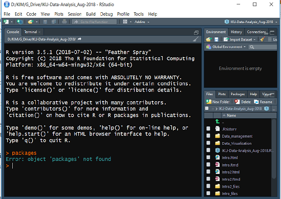
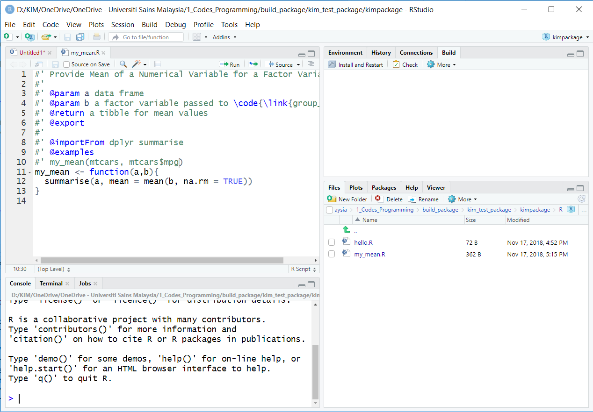
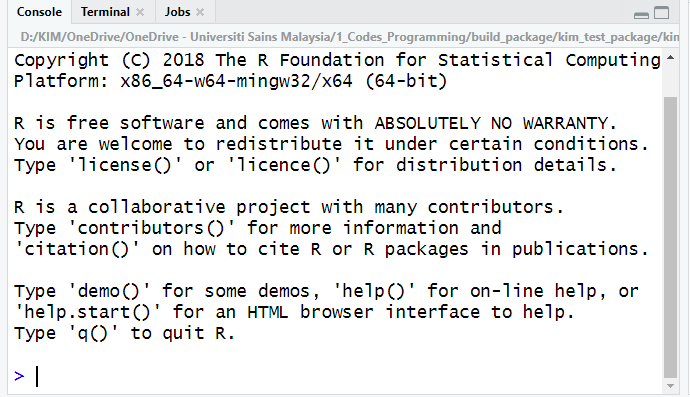
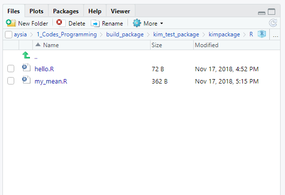
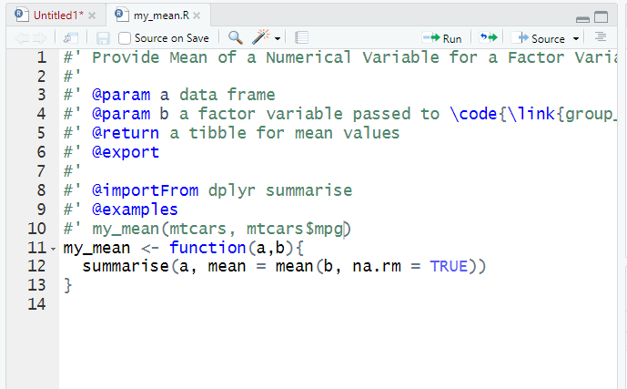

```{r setup, include=FALSE}
knitr::opts_chunk$set(echo = TRUE, strip.white = TRUE, message = FALSE, error = FALSE)
knitr::opts_chunk$set(out.width = "70%", out.extra = "keepaspectratio", fig.asp = 1, fig.align = "center")
#knitr::opts_chunk$set(out.width = "70%", fig.align = "center")
```

```{r bib, include=FALSE}
# create a bib file for the R packages used in this document
knitr::write_bib(c('foreign', 'lattice', 'epiDisplay', 'psych', 'rsq', 'MASS', 'car', 'broom'), file = 'skeleton.bib')
knitr::write_bib(c('car', 'foreign', 'ggplot2', 'lattice', 'plyr', 'psych'), file = 'skeleton1.bib')
```


<!--chapter:end:index.Rmd-->

---
output:
  pdf_document: default
---

# Preface {-}

This is the **draft** version of our book on  making plots, exploring data and doing regression analysis in R.

All in all, we hope you enjoy this book!


<p>&nbsp;</p>


**Kamarul Imran Musa**

<p>&nbsp;</p>

**Wan Nor Arifin Wan Mansor**


*School of Medical Sciences,* 

*Universiti Sains Malaysia*


<!--chapter:end:01_preface.Rmd-->

\mainmatter

# Introduction to R, RStudio and RStudio Cloud

This chapter will introduce to readers to 

- R and RStudio
- RStudio Cloud
- Installation for R and RStudio
- Optional installation for Miktex or Texlive and MacTex  
- R scripts, R packages, R Taskview


## RStudio Cloud

RStudio cloud facilitates the learning of R. Anyone can sign up and start using RStudio on the cloud.

It is one of the the quickest way to learn R. You do not need to install R on your machine. RStudio Cloud allows collaborration between teachers and students. It also helps colleagues working together on R codes. 

RStudio Cloud is free for now. To start, you need to visit <https://rstudio.cloud/> and register.


### The RStudio Cloud Interface

This is the interface for RStudio Cloud. 

[]


### Register and log in

You can register now. After registration, you can log in. 

[]


## Point and click R GUI

There are a number of SPSS-like GUI for R. For example 

- Bluesky statistics <https://www.blueskystatistics.com/>
- JAMOVI - <https://www.jamovi.org/>

This is Bluesky statistics

[]

And this is JAMOVI

[]


## RStudio Server

You can run R and RStudio on the server. To do this you have to install  RStudio Server. having RStudio Server enables you to do analysis on the server.

This will give a taste of working on BIG DATA. There are two versions of RStudio Server

- RStudio Server 
- RStudio Server Professional 
  
For example, we have our RStudio Server Professional Edition (courtesy of RStudio) running on our server here <https://healthdata.usm.my/rstudio/auth-sign-in>
  

## Installation 

To install R on your machine, you have to have **Admin Right** to your machine. We recommend that you install 

- R
- RStudio

It is optional to install Latex editor for example MiKTeX and TeXLive for Windows and MacTex for Mac OS.

### Installation for R

Though you can use R to run R codes. But we highly enciurage you to install both R and RStudio. 

To install R, go to [cran](https://cran.r-project.org/). Then choose the correct R version for your machine OS. For example, for Windows OS the link is <https://cran.r-project.org/bin/windows/base/R-3.6.1-win.exe>. And for Mac OS, the download link is  <https://cran.r-project.org/bin/macosx/R-3.6.1.pkg>. Similarly, if you are using Linux, follow the steps as listed before.

[]


### Installation for RStudio

You can install RStudio for your OS from here <https://www.rstudio.com/products/rstudio/download/#download>. Choose the supported platforms. The size of download will be around 70-90 MB.

[]


### Check R and RStudio on your machine

Now, we assume you have installed R and RStudio. Please, check 

- Do you have R? 
- what version of R do you have?
- Do you have RStudio? 
- what version of RStudio do you have?
- Do you need to update R and RStudio?


### Installation of MiKTeX, TeXLive and MacTex

It is necessary to install Latex editor if you want to convert the outputs to pdf. Especially, if you run your codes on RMarkdown. It is because RMarkdown can produce different types of documents. 

]

This is MiKTeX, for Window OS 


And this is MacTeX, for Mac OS


## Start your RStudio 


You can either login to RStudio Cloud OR start RStudio on your machine. remember, to login to RStudio Cloud, go to <https://rstudio.cloud>. Then you will be asked for your username and password.  

Click this link <https://rstudio.cloud/spaces/44275/join?access_code=LPLoq5Q4kSdtBv1AN8kcHP%2FHG0DiW1kGj4jVtG4k>


To start R on your machine, find the Rstudio program in your start bar in your machine



What you see on RStudio now? You should see three panes if you start Rstudio for the first time or four  panes if you have used RStudio before.




### Console tab

In Console tab, this is where we will see most of the results




### Files, Plots, Packages, Help and Viewer Pane 

In this console, you will see

- List of objects
- R files, datasets, tables, list etc 



### Environment, History, Connection and Build Pane

In the environment, history, connection and build pane, you will see this


### Source Pane 

In the Source pane, you can create R files and write your R codes




## Open a new R script

To open a new R script

- File -> R Script
- In Window OS, CTRL-SHIFT-N


### Our first R script

Let us write our first R script. 

- In Line 1, type `2 + 3` 
- click CTRL-ENTER or CMD-ENTER 
- see the outputs in the Console Pane

```{r}
2 + 3
```

After writing your R script, you can save it. This will allow to use or run the R script the next time you run RStudio. 

To save R script

- File ->
- Save As ->
- Choose folder ->  
- Name the file

Now, types this to check the version of R

```{r}
version[6:7]
```

The current version for R is `r version[6:7]`

If you lower version, then you want to upgrade. To upgrade

- for Windows, you can use **installr** package
- for Mac OS, you can use some functions 

More info here <https://www.linkedin.com/pulse/3-methods-update-r-rstudio-windows-mac-woratana-ngarmtrakulchol/>


### function, argument and parameters

R codes contain

- function
- argument
- parameters

```
f <- function(<arguments>) {
## Do something interesting
}
```
For example, for the function `lm()` to estimate parameters for linear regression model

```{r}
args(lm)
```


For example:

```{r}
lm(weight ~ Time, data = ChickWeight)
```

Ref: 

- <https://www.stat.auckland.ac.nz/~ihaka/downloads/Waikato-WRUG.pdf>
- <https://www.stat.berkeley.edu/~statcur/Workshop2/Presentations/functions.pdf> 


### Need more help?

Then type the ? before the function

```{r}
?lm
```

See what will be displayed in Help Pane


## Packages


### Packages on CRAN

<https://cran.r-project.org/>

- Currently, the CRAN package repository features 12784 available packages
- Cran Task Views 


### Check if the package you need is available in your R library

Type this inside your console

```{r}
library(ggplot2)
```

You should not receive any error message. If you have not installed the package, you will receive and error message. And it tells you that the package is not available in your R. the package is stored in the R folder in your My Document or HOME directory

```{r}
.libPaths()
```


### Install an R package 

To install an R package, you can type below (without the # tag)

```{r}
# install.packages(foreign, dependencies = TRUE)
```

You need to have internet access. You can install from a zip file (from your machine or USB), from github and other repo


## Directory

This is important. Not knowing your working directory will make you lost (you do not know where your R codes, R outputs, datasets etc)

You must know where your folder is located. The folder can contain many sub folders. The folder should contain dataset (if you want to analyze your data). It will later store the objects created during R session

```{r}
getwd()
```

You have to know to write file path. It is written differently for Window OS and other OS


### Starting your R job

There are 2 ways to start your job:

- create a new project (recommended)
- setting your working directory using `setwd()` (not recommended)


### Create new project

Always create a new project (This is the recommended way). This can be by 

- Go to `File -> New Project`

[]

When you see project type, click New Project


### Where is my data?

Datasets for analysis in R and usually in data frame format. You can see the datasets in the environment pane. Your data is read from the original dataset to a memory. SO you must know the size of your computer RAM. How much your RAM for your machine? The bigger the RAM, thelarger R can read and store your data. 

The data that is read (in memory) will dissaper once you close RStudio. But the original stays in its location. This will not change your original data (so be happy!)


## Upload data to RStudio Cloud

You have to upload data to RStudio Cloud  Or link data to dropbox folder


## More resources on RStudio Cloud

You can learn more about RStudio Cloud here

- on YouTube : RStudio Cloud for educationn <https://www.youtube.com/watch?v=PviVimazpz8>

- YouTube: Working with R in Cloud <https://www.youtube.com/watch?v=SFpzr21Pavg>


## Need help?

If you need help you can

-  Type a question mark infront of a function

```{r}
?plot
```

Other options are these:

- register and join RStudio Community here <https://community.rstudio.com/>
- Ask questions on Stack Overflow <https://stackoverflow.com/>
- Search for mailing list and subscribe to it
- Books on R <https://bookdown.org/>


## Bookdown

This webpage contains many useful books that use R codes <https://bookdown.org/>
 


<!--chapter:end:02_Intro_to_R.Rmd-->

# Data Visualization

## Introduction to visualization

Data visualization is viewed by many disciplines as a modern equivalent of visual communication. It involves the creation and study of the visual representation of data. Data visualization requires "information that has been abstracted in some schematic form, including attributes or variables for the units of information". You can read more about data visualization here <https://en.m.wikipedia.org/wiki/Data_visualization> and here <https://en.m.wikipedia.org/wiki/Michael_Friendly>  

### History of data visualization

In his 1983 book which carried the title *The Visual Display of Quantitative Information*, the author Edward Tufte defines **graphical displays** and principles for effective graphical display. The book mentioned that "Excellence in statistical graphics consists of complex ideas communicated with clarity, precision and efficiency."

### Processes and Objectives of visualization

Visualization is the process of  representing data graphically and  interacting with these representations. The objective is to gain insight into the data. Some of the processes are outlined here <http://researcher.watson.ibm.com/researcher/view_group.php?id=143>

## What makes good graphics


You may require these to make good graphics:

1.  Data
2.  Substance rather than about methodology, graphic design, the technology of graphic production or something else
3.  No distortion to what the data has to say
4.  Presence of many numbers in a small space
5.  Coherence for large data sets
6.  Encourage the eye to compare different pieces of data
7.  Reveal the data at several levels of detail, from a broad overview to the fine structure
8.  Serve a reasonably clear purpose: description, exploration, tabulation or decoration
9.  Be closely integrated with the statistical and verbal descriptions of a data set.

## Graphics packages in R

There are many **graphics packages** in R. Some packages are aimed to perform general tasks related with graphs. Some provide specific graphics for certain analyses. The popular general graphics packages in R are:

1.  **graphics** : a base R package
2.  **ggplot2** : a user-contributed package by Hadley Wickham
3.  **lattice** : a user-contributed package


Except for **graphics** package (a a base R package), other packages need to downloaded and installed into your R library. Examples of other more specific packages - to run graphics for certain analyses - are:

1.  **survminer::ggsurvlot**
2.  **sjPlot**

For this course, we will focus on using the **ggplot2** package. 

## Introduction to **ggplot2** package

The **ggplot2** package is an elegant, easy and versatile general graphics package in R. It implements the **grammar of graphics** concept. The advantage of this concept is that, it fasten the process of learning graphics. It also facilitates the process of creating complex graphics

To work with **ggplot2**, remember

- start with: `ggplot()`
- which data: `data = X`
- which variables: `aes(x = , y = )`
- which graph: `geom_histogram()`, `geom_points()`

The official website for ggplot2 is here <http://ggplot2.org/>.

*ggplot2 is a plotting system for R, based on the grammar of graphics, which tries to take the good parts of base and lattice graphics and none of the bad parts. It takes care of many of the fiddly details that make plotting a hassle (like drawing legends) as well as providing a powerful model of graphics that makes it easy to produce complex multi-layered graphics.*

## Preparation

### Set a new project or set the working directory

It is always recommended that to start working on data analysis in RStudio, you create first a new project.

Go to File, then click New Project. 

You can create a new R project based on existing directory. This method is useful because an RStudio project keep your data, your analysis, and outputs in a clean dedicated folder or sets of folders.If you do not want to create a new project, then make sure you are inside the correct directory (the working directory). The working directory is a folder where you store. 

Type `getwd()` in your Console to display your working directory. Inside your working directory, you should see and keep

1.  dataset or datasets
2.  outputs - plots 
3.  codes (R scripts `.R`, R markdown files `.Rmd`)

### Questions to ask before making graphs

You must ask yourselves these:

1.  Which variable or variables do I want to plot?
2.  What is (or are) the type of that variable? 
- Are they factor (categorical) variables ? 
- Are they numerical variables?
3.  Am I going to plot 
- a single variable?
- two variables together?
- three variables together?

 

### Read data

The common data formats include

1.  comma separated files (`.csv`)
2.  MS Excel file (`.xlsx`)
3.  SPSS file (`.sav`)
4.  Stata file (`.dta`)
5.  SAS file 

Packages that read these data include **haven** package. Below are the functions to read SAS, SPSS and Stata file. 

1.  SAS: `read_sas()` reads .sas7bdat + .sas7bcat files and read_xpt() reads SAS transport files (version 5 and version 8). write_sas() writes .sas7bdat files.
2.  SPSS: `read_sav()` reads .sav files and read_por() reads the older .por files. write_sav() writes .sav files.
3.  Stata: `read_dta()` reads .dta files (up to version 15). write_dta() writes .dta files (versions 8-15).

Data from databases are less common but are getting more important and more common. R can also read these data. Some examples of databases format are:

1.  MySQL
2.  SQLite
3.  Postgresql
4.  Mariadb


### Load the library

The **ggplot2** package is one of the core member of **tidyverse** package (<https://www.tidyverse.org/>). So, if we load the **tidyverse** package, we will access to other packages under **tidyverse** which include **dplyr**, **readr**, **ggplot2**. 

Loading a package will give you access to

1.  help pages
2.  functions
3.  datasets

```{r}
library(tidyverse)
```

If you run the code and you see *there is no package called tidyverse* then you need to install the **tidyverse** package. To install the package, type `install.package("tidyverse")` in the Console. Once the installation is complete, type `library(tidyverse)` to load the package.

### Open dataset

For now, we will use the built-in dataset in the **gapminder** package. You can read more about *gapminder* from <https://www.gapminder.org/>. The gapminder website contains many useful datasets and show wonderful graphics. It is made popular by Dr Hans Rosling.

To load the package, type 

```{r}
library(gapminder)
```

call the data *gapminder* into R and browse the first 6 observations of the *gapminder* data

```{r}
gapminder <- gapminder
head(gapminder)
```

We can list the variables and look at the type of the variables in the dataset

```{r}
glimpse(gapminder)
```

The *gapminder* data have

1.  6 variables
2.  1704 observations
3.  There are 2 factor variables, 2 integer variables and 2 numeric variables

We can examine the basic statistics of the datasets by using `summary()`. This function will list

1.  the frequencies 
2.  some descriptive statistics: min, 1st quartile, median, mean, 3rd quartile and max

```{r}
summary(gapminder)
```

To know more about the package, we can use the $?$ mark 

```{r}
?gapminder
```


## Basic plot

We can start create a basic plot by setting these parameters

- data = gapminder
- variables = year, lifeExp
- graph = scatterplot

In **ggplot2** which is a package under **tidyverse** package, you can use the $+$ sign to connect the function. And in R, your codes can span multiple lines. This will increase the visibility of the codes.  

```{r}
ggplot(data = gapminder) +
  geom_point(mapping = aes(x = year, y = lifeExp))
```

Now, you can see that the plot shows:

1.  the relationship between year and life expectancy. 
2.  as variable year advances, the life expectancy increases. 

the `ggplot()` tells R to plot what variables from what data. And `geom_point()` tells R to make a scatter plot.

## Adding another variable

You realize that we plotted 2 variables based on `aes()`. We can add the third variable to make a more complicated plot. For example:

1.  data = gapminder
2.  variables = year, life expectancy, continent

For this, the objective to create plot might be to see the relationship between year and life expectancy based on continent.

```{r}
ggplot(data = gapminder) +
  geom_point(mapping = aes(x = year, y = lifeExp, colour = continent))

```

What can you see from the scatterplot? You may notice that

1.  Europe countries have high life expectancy
2.  Africa countries have lower life expectancy
3.  One Asia country looks like an outlier (very low life expectancy)
4.  One Africa country looks like an outlier (very low life expectancy)


Now, we will replace the 3rd variable with GDP (variable gdpPercap) and make the plot correlates with the size of GDP.

```{r}
ggplot(data = gapminder) +
  geom_point(mapping = aes(x = year, y = lifeExp, size = gdpPercap))

```

*ggplot2* will automatically assign a unique level of the aesthetic (here a unique color) to each unique value of the variable, a process known as scaling. *ggplot2* will also add a legend that explains which levels correspond to which values. The plot suggets that higher GDP countries have longer life expectancy. 

Instead of using colour, we can use shape especially in instances where there is no facility to print out colour plots.

```{r}
ggplot(data = gapminder) +
  geom_point(mapping = aes(x = year, y = lifeExp, shape = continent))

```

But, see what will happen if you set the colour and shape like below but outside the aes parentheses. For example, let set the parameter colour to blue

```{r}
ggplot(data = gapminder) +
  geom_point(mapping = aes(x = year, y = lifeExp), colour = 'blue')

```


And then parameter shape to plus (which is represented by number 3).  


```{r}
ggplot(data = gapminder) +
  geom_point(mapping = aes(x = year, y = lifeExp), shape = 3)

```

You may wonder what number corresponds to what type of shape. You can type $?pch$. And you will see in the Viewer pane, the explanation about the shape available in R. It also shows what number that corresponds to what shape.


## Making subplots

We can split our plots based on a factor variable and make subplots using the `facet()`. For example, if we want to make subplots based on continents, then you need to set these parameters:

- data = gapminder
- variable year on the x-axis and lifeExp on the y-axis
- split the plot based on continent
- the number of rows for the plot are 3

```{r}
ggplot(data = gapminder) +
  geom_point(mapping = aes(x = year, y = lifeExp)) + 
  facet_wrap(~ continent, nrow = 3)
```

Now, what happen if we change the value for the nrow

```{r}
ggplot(data = gapminder) +
  geom_point(mapping = aes(x = year, y = lifeExp)) + 
  facet_wrap(~ continent, nrow = 2)
```

## Overlaying plots

Each `geom_X()` in ggplot2 indicates different visual objects.

This is a scatterplot

```{r}
ggplot(data = gapminder) +
  geom_point(mapping = aes(x = gdpPercap, y = lifeExp))
```
 

This is a smooth line

```{r}
ggplot(data = gapminder) +
  geom_smooth(mapping = aes(x = gdpPercap, y = lifeExp))
```

And we can regenerate the smooth plot based on continent using the `linetype()`. We use `log(gdpPercap)` to reduce the skewness of the data.

```{r}
ggplot(data = gapminder) +
  geom_smooth(mapping = aes(x = log(gdpPercap), y = lifeExp, linetype = continent))
```

Another smooth plot but setting the parameter for colour

```{r}
ggplot(data = gapminder) +
  geom_smooth(mapping = aes(x = log(gdpPercap), y = lifeExp, colour = continent))
```


## Combining geom

We can combine more than one geoms to overlay plots. The trick is to use multiple geoms in a single line of R code

```{r}
ggplot(data = gapminder) +
  geom_point(mapping = aes(x = log(gdpPercap), y = lifeExp)) +
  geom_smooth(mapping = aes(x = log(gdpPercap), y = lifeExp))
```

The codes above show duplication or repetition. To avoid this, we can pass the mapping to `ggplot()`. 

```{r}
ggplot(data = gapminder, mapping = aes(x = log(gdpPercap), y = lifeExp)) +
  geom_point() +
  geom_smooth()
```

And we can expand this to make scatterplot shows different colour for continent
 
```{r}
ggplot(data = gapminder, mapping = aes(x = log(gdpPercap), y = lifeExp)) +
  geom_point(mapping = aes(colour = continent)) +
  geom_smooth()
```

Or expand this to make the smooth plot shows different colour for continent

```{r}
ggplot(data = gapminder, mapping = aes(x = log(gdpPercap), y = lifeExp)) +
  geom_point() +
  geom_smooth(mapping = aes(colour = continent))
```

Or both the scatterplot and the smoothplot

```{r}
ggplot(data = gapminder, mapping = aes(x = log(gdpPercap), y = lifeExp)) +
  geom_point(mapping = aes(shape = continent)) +
  geom_smooth(mapping = aes(colour = continent))

```


## Statistical transformation

Let us create a bar chart, with y axis as the frequency.

```{r}
ggplot(data = gapminder) +
  geom_bar(mapping = aes(x = continent))
```

If we want the y-axis to show proportion, we can use these codes

```{r}
ggplot(data = gapminder) +
  geom_bar(mapping = aes(x = continent, y = ..prop..,
                         group = 1))
```


## Customizing title

We can customize many aspects of the plot using ggplot package. For example, from gapminder dataset, we choose GDP and log it (to reduce skewness) and life expectancy, and make a scatterplot. We named the plot as `my_pop`

```{r}
mypop <- ggplot(data = gapminder, mapping = aes(x = log(gdpPercap), y = lifeExp)) +
  geom_point() +
  geom_smooth(mapping = aes(colour = continent))
mypop
```

You will notice that there is no title in the plot. A title can be added to the plot.

```{r}
mypop + ggtitle("Scatterplot showing the relationship of GDP in log and life expectancy")
```

Title in multiple lines by adding `\n`

```{r}
mypop + ggtitle("Scatterplot showing the relationship of GDP in log and life expectancy:
                \nData from Gapminder")
```


## Adjusting axes

We can specify the tick marks

1.  min = 0
2.  max = 12
3.  interval = 1

```{r}
mypop + scale_x_continuous(breaks = seq(0,12,1))
```

And we can label the x-axis and y-axis

```{r}
mypop + ggtitle("Scatterplot showing the relationship of GDP in log and life expectancy:
                \nData from Gapminder") + ylab("Life Expentancy") + xlab("Percapita GDP in log")
```

## Choosing theme

The default is gray theme or `theme_gray()`

This is the black and white theme

```{r}
mypop + theme_bw()
```

This is the classic theme

```{r}
mypop + theme_classic()
```


## Saving plot 

In R, you can save the plot into different format. You can also set other parameters such as the dpi and the size for the plot. One of the preferred formats for saving a plot is as a PDF format.

## Saving plot using ggplot2

Here, we will show how to save plots in R. In this example, let us use the object for the plot named `mypop` and add a title, an x label, an y label and choose the classic theme,

```{r}
myplot <- mypop + 
ggtitle("Scatterplot showing the relationship of GDP in log and life expectancy:
                \nData from Gapminder") + ylab("Life Expentancy") + 
  xlab("Percapita GDP in log") +
  scale_x_continuous(breaks = seq(0,12,1)) +
  theme_classic()
myplot
```


We now can see a nice plot. And next, we want to save the plot (currently on the screen) to these formats:

1.  `pdf` format
2.  `png` format
3.  `jpg` format

The codes we can use are:

```{r}
library(here)
ggsave(plot = myplot, here("plots","my_pdf_plot.pdf"))
ggsave(plot = myplot, here("plots","my_png_plot.png")) 
ggsave(plot = myplot, here("plots","my_jpg_plot.jpg"))
```

If we want to add more customization before saving the plot, for example, we want to set these parameters:  

1.  width = 10 cm (or you can use `in`)
2.  height = 6 cm (or you can use `in`)
3.  dpi = 150. dpi is dots per inch

Now, you can run these codes 

```{r}
ggsave(plot = myplot, here('plots','my_pdf_plot2.pdf'), 
                           width = 10, height = 6, units = "in",
                           dpi = 150, device = 'pdf')
ggsave(plot = myplot, here('plots','my_png_plot2.png'), 
       width = 10, height = 6, units = "cm", 
       dpi = 150, device = 'png')
ggsave(plot = myplot, here("plots","my_jpg_plot2.jpg"), 
       width = 10, height = 6, units = "cm",
       dpi = 150, device = 'jpg')
```


<!--chapter:end:03_data_visualization.Rmd-->


# Data Wrangling  

## Definition of data wrangling  

Data wrangling is also known as Data Munging or Data Transformation. It is loosely the process of manually converting or mapping data from one "raw" form into another format. The process allows for more convenient consumption of the data. In doing so, we will be using semi-automated tools in RStudio. You can find more information here <https://community.modeanalytics.com/sql/tutorial/data-wrangling-with-sql/>

## Data wrangling with **dplyr** package

### **dplyr** package 

**dplyr** is a package grouped inside **tidyverse** collection of packages. **dplyr** package is a very useful package to munge or wrangle or to tranform your data. It is a grammar of data manipulation. It provides a consistent set of verbs that help you solve the most common data manipulation challenges. This **tidyverse** webpage <https://github.com/tidyverse/dplyr> has more information and examples. 

## Common procedures for doing data transformation 

The common data wrangling procedures that data analyst does include:

1.  reducing the size of dataset by selecting certain variables (or columns)
2.  generating new variable from existing variables 
3.  sorting observation of a variable 
4.  grouping observations based on certain criteria
5.  reducing variable to groups to in order to estimate summary statistic 

## Some **dplyr** functions 

For the procedures listed above, the corresponding **dplyr** functions are

1.  `dplyr::select()` - to select a number of variables from a dataframe
2.  `dplyr::mutate()` - to generate a new variable from existing variables 
3.  `dplyr::arrange()` - to sort observation of a variable
4.  `dplyr::filter()` - to group observations that fulfil certain criteria 
5.  `dplyr::group_by()` and `dplyr::summarize()` - to reduce variable to groups in order to provide summary statistic  


## Create a new project or set your working directory

It is very important to ensure you know where your working directory is. To do so, the best practice is *is to create a new project everytime you want to start new analysis with R*. To do so, create a new project by `File -> New Project`. If you do not start with a new project, you still need to know **Where is my working directory?**. 

So, again we emphasize that every time you want to start processing your data, please make sure:

1.  you use R project. It is much easier and cleaner to start your work with a new R project. Once you have done or need to log off your computer, close the project and reopen the project the next time you need to.  
2.  that if you are not using R project, you are inside the correct working directory. Type `getwd()` to display the active **working directory**.  And to set a new working directory use the function `setwd()`. Once you are know where your working directory is, you can start read or import data into your working directory. 


Once you are inside the project, you can import your data if necessary. Remember, there are a number of packages you can use to read the data into R. R can read almost all (if not all format) types of data format. For example, we know that common data format are the:

1.  SPSS (`.sav`) format, 
2.  Stata (`.dta`) format, 
3.  SAS format, 
4.  MS Excel (`.xlsx`) format
5.  Comma-separated-values `.csv` format. 

But they are other formats too for examples data in DICOM format. DICOM format data includes data from CT scan and MRI images. There are data in shapefile format to store geographical information. Three packages - **haven**, **readr** and **foreign** packages - are very useful to read or import your data into R memory. 

1.  **readr** provides a fast and friendly way to read rectangular data (like csv, tsv, and fwf).
2.  **readxl** reads .xls and .xlsx sheets.
3.  **haven** reads SPSS, Stata, and SAS data.

## *starwars* data

To make life easier and to facilitate reproducibility, we will use examples available from the public domains. We will produce and reproduce the outputs demonstrated on **tidyverse** website (<https://github.com/tidyverse/dplyr>). One of the useful datasets is `starwars` dataset. The `starwars` data comes together with **dplyr** package. This original source of data is from SWAPI, the Star Wars API accessible at http://swapi.co/. 

The `starwars` data is class of `tibble`. The data have:

- 87 rows (observations) 
- 13 columns (variables)

Now, let us:

1.  load the **tidyverse** package
2.  examine the column names (variable names) 

Loading **tidyverse** packages will load **dplyr** automatically. If you want to load only **dplyr**, just type `library(dplyr)`.

```{r activatedplyr}
library(dplyr)
```

Take a peek at the `starwars` data

```{r}
glimpse(starwars)
```

Next, we examine the first 10 observations of the data. There are 77 more rows NOT SHOWN. You can also see the types of the variables:

1.  `chr` (character),
2.  `int` (integer), 
3.  `dbl` (double)

```{r datastarwars1}
starwars
```

## Select variables, generate new variable and rename variable

We will work with these functions

- `dplyr::select()`
- `dplyr::mutate()` and
- `dplyr::rename()`

### Select variables using `dplyr::select()`

When you work with large datasets with many columns, sometimes it is easier to select only the necessary columns to reduce the size of dataset. This is possible by creating a smaller dataset (less variables). Then you can work on at the initial part of data analysis with this smaller dataset. This will greatly help data exploration.   

To create smaller datasets, select some of the columns (variables) in the dataset. For example, in `starwars` data, we have 13 variables. From this dataset, let us generate a new dataset named as `mysw` with only these 4 variables , 
1.  name
2.  height
3.  mass 
4.  gender

```{r}
mysw <- starwars %>% select(name, gender, height, mass)
mysw
```


The new dataset `mysw` is now created. You can see it in the `Environment` pane.

### Generate varibale using `dplyr::mutate()`

With `dplyr::mutate()`, you can generate new variable. For example, in the dataset `mysw`, we want to create a new variable named as `bmi`. This variable equals mass in kg divided by squared height (in meter) 

$$bmi = \frac{kg}{m^2}$$


```{r}
mysw <- mysw %>% mutate(bmi = mass/(height/100)^2)
mysw
```

Now, your dataset `mysw` has 5 columns (variables). The last variable is `bmi`

### Rename variable using `dplyr::rename()`

Now, 

1.  create a new variable *bmi2* which equals $bmi^2$.
2.  rename *bmi2* to *bmisq*

```{r}
mysw <- mysw %>% mutate(bmi2 = bmi^2)
mysw
mysw <- mysw %>% rename(bmisq = bmi2)
mysw
```


## Sorting data and select observation

The function `dplyr::arrange()` can sort the data. And the function `dplyr::filter()` allows you to select observations based on your criteria. 

### Sorting data using `dplyr::arrange()`

We can sort data in ascending or descending order. To do that, we will use `dplyr::arrange()`. It will sort the observation based on the values of the specified variable. For dataset `mysw`, let us sort the `bmi` from the biggest bmi (descending).  

```{r}
mysw <- mysw %>% arrange(desc(bmi))
mysw
```

Now, we will replace the dataset `mysw` with data that contain the `bmi` values from the lowest to the biggest bmi (ascending). 

```{r}
mysw <- mysw %>% arrange(bmi)
mysw
```


### Select observation using `dplyr::filter()`

To select observations based on certain criteria, we use the `dplyr::filter()` function. Here, in this example, we will create a new dataset (which we will name as `mysw_m_40`) that contains observations with these criteria:

- gender is male AND
- bmi at or above 40

```{r}
mysw_m_40 <- mysw %>% filter(gender == 'male', bmi >= 40)
mysw_m_40
```

Next, we will create a new dataset (named as `mysw_ht_45`) that contain

- `height` above 200 OR `BMI` above 45, AND
- does not include `NA` (which is missing value) observation for `bmi`

```{r}
mysw_ht_45 <- mysw %>% filter(height >200 | bmi >45, bmi != 'NA')
mysw_ht_45
```

## Group data and get summary statistics 

The`dplyr::group_by()` function allows us to group data based on categorical variable. Using the  `dplyr::summarize` we do summary statistics for the overall data or for groups created using `group_by()` function. 

### Group data using `dplyr::group_by()`

The `group_by` function will prepare the data for group analysis. For example, 

1.  to get summary values for mean `bmi`, mean `ht` and mean `mass`
2.  for male, female, hermaphrodite and none (`gender` variable)

```{r}
mysw_g <- mysw %>% group_by(gender)
mysw_g
```

### Summary statistic using `dplyr::summarize()`

Now that we have a group data named `mysw_g`, now, we would summarize our data using the mean and standard deviation (SD) for the groups specified above. 

```{r}
mysw_g %>% summarise(meanbmi = mean(bmi, na.rm = TRUE), 
                     meanht  = mean(height, na.rm = TRUE),
                     meanmass = mean(mass, na.rm = TRUE),
                     sdbmi = sd(bmi, na.rm = TRUE),
                     sdht = sd(height, na.rm = TRUE),
                     sdmass = sd(mass, na.rm = TRUE))
```

To calculate the frequencies for one variable

```{r}
freq_species <- starwars %>% count(species, sort = TRUE)
freq_species
```

And to calculate the frequencies for two variables. You can add the categorical or factor variable to get the frequencies for more groups. 

```{r}
freq_species_home <- starwars %>% count(species, homeworld, sort = TRUE)
freq_species_home
```


## More complicated **dplyr** verbs

To be more efficent, use multiple **dplyr** functions in one line of R code. For example, 

```{r filterstarwars}
starwars %>% filter(gender == "male", height > 100, mass > 100) %>% 
  select(height, mass, species) %>%
  group_by(species) %>%
  summarize(mean_ht = mean(height, na.rm = TRUE), 
            mean_mass = mean(mass, na.rm = TRUE),
            freq = n())
```


## Data transformation for categorical variables 

### **forcats** package

Data transformation for categorical variables (factor variables) can be facilitated using the **forcats** package. 

### Create a dataset

Let us create create a dataset to demonstrate **forcats** package. The dataset will contain

1.  a vector column named as **sex1** , values = 0,1
2.  a vector column named as **race1** , values = 1,2,3,4
3.  a tibble dataframe (dataset) named as **data_f**

```{r}
sex1 <- rbinom(n = 100, size = 1, prob = 0.5) 
str(sex1)
race1 <- rep(seq(1:4), 25)
str(race1)
data_f <- tibble(sex1, race1)
head(data_f)
```

Now let us see the structure of the dataset. You should see that they are all in the integer (numerical) format

```{r}
str(data_f)
```

### Conversion from numeric to factor variables

Now, we will convert the integer (numerical) variable to a factor (categorical) variable. For example, we will generate a new factor (categorical) variable named as `male` from variable `sex1` (which is an integer variable). We will label `male`as *No* or *Yes*.

We then generate a new factor (categorical) variable named as `race2` from `race1` (which is an integer variable) and label as *Mal, Chi, Ind, Others*

```{r}
data_f$male <- factor(data_f$sex1, labels = c('No', 'Yes')) 
data_f$race2 <- factor(data_f$race1, labels = c('Mal', 'Chi', 'Ind', 'Others')) 
str(data_f)
head(data_f) ; tail(data_f)
```

### Recoding variables using `forcats::fct_recode()`

We use this function to recode variables from the old levels to the new levels. Let us say that our objectives is to:

1.  modify the levels for variable **male** by changing the levels from `No` vs `Yes` to `Fem` and `Male`, respectively.
2.  create a new variable **malay** from variable **race2**. We then want to label `Chi` to `Non-Malay`, `Ind` to `Non-Malay` and `Others` to `Non-Malay`. But we keep `Mal` as it is.

To do that, use the codes below, 

```{r useforcats} 
library(forcats)
data_f$male2 <- data_f$male %>% fct_recode('Fem' = 'No', 'Male' = 'Yes')
data_f <- data_f %>% mutate(malay = fct_recode(race2, 
                                        'Non-Malay' = 'Chi', 
                                        'Non-Malay' = 'Ind', 
                                        'Non-Malay' = 'Others'))
head(data_f) ; tail(data_f)
```

## Summary

**dplyr** package is a very useful package that encourages users to use proper verb when manipulating variables (columns) and observations (rows). We have learned to use 5 functions but there are more functions available.  Other useful functions include:

1.  `dplyr::distinct()`
2.  `dplyr::transmutate()`
3.  `dplyr::sample_n()` and `dplyr::sample_frac()`

Also note that, package **dplyr** is very useful when it is combined with another function that is `group_by`

If you working with database, you can use **dbplyr** which has been developed to perform very effectively with databases. 

For categorical variables, you can use **forcats** package. 

## Self-practice

If you have completed the tutorial above, you may:

1.  Read your own data (hints: **haven**, **foreign**) or you can download data from <https://www.kaggle.com/datasets> . Maybe can try this dataset <https://www.kaggle.com/blastchar/telco-customer-churn>
2.  Create a smaller dataset by selecting some variable (hints: `dplyr::select()`)
3.  Creating a dataset with some selection (hints: `dplyr::filter()`)
4.  Generate a new variable (hints`dplyr::mutate()`)
5.  Creata an object using pipe and combining `dplyr::select()`, `dplyr::filter()` and `dplyr::mutate()` in one single line of R code
6.  Summarise the mean, standard deviation and median for numerical variables `dplyr::group_by()` and `dplyr::summarize()`
7.  Calculare the number of observations for categorical variables (hints: `dplyr::count()`)
8.  Recode a categorical variable (hints: `forcats::fct_recode()`)


## References

1.  dplyr vignettes here <https://cran.r-project.org/web/packages/dplyr/vignettes/dplyr.html>
2.  forcats examples here <http://r4ds.had.co.nz/factors.html>
3.  reading data into R <https://garthtarr.github.io/meatR/rio.html>


<!--chapter:end:04_data_transformation.Rmd-->


# Exploratory data analysis (EDA)

## Motivation 

In statistics, exploratory data analysis (EDA) is an approach in data analysis in order to summarize their main characteristics, often with visual methods. 

A statistical model can be used or not, but primarily EDA is for seeing what the data can tell us beyond the formal modeling or hypothesis testing task. 

Exploratory data analysis was promoted by John Tukey to encourage statisticians to explore the data, and possibly formulate hypotheses that could lead to new data collection

Source: https://en.wikipedia.org/wiki/Exploratory_data_analysis

## Questions to ask before making graphs

You must ask yourselves these:

- Which data do I want to use? `data = `
- Which variable or variables do I want to plot? `mapping = aes()`
- What is (or are) the type of that variable? 
    - Are they factor (categorical) variables ? 
    - Are they numerical variables?
- Am I going to plot 
    - a single variable?
    - two variables together?
    - three variables together?
- What plot? `geom_` 

## EDA using ggplot2 package

### Usage of **ggplot2** 

1.  start with `ggplot()`
2.  supply a dataset `data = `
3.  and aesthetic mapping (with `aes()`) - variables
4.  add on layers

- geom_X : `geom_point()`, `geom_histogram()`
- scales (like `scale_colour_brewer()`)
- faceting specifications (like `facet_wrap()`)
- coordinate systems (like `coord_flip()`).


## Loading the library

### **tidyverse** package for EDA

We will load the **tidyverse** library

The tidyverse is an opinionated collection of R packages designed for data science. All packages share an underlying design philosophy, grammar, and data structures. 

<https://www.tidyverse.org/>

```{r}
library(tidyverse)
```

### the **gapminder** for dataset

And load **gapminder** package to use the *gapminder* dataset

Excerpt from the Gapminder data. The main object in this package is the gapminder data frame or *tibble*. 

There are other goodies in the package, such as the data in tab delimited form, a larger unfiltered dataset, premade color schemes for the countries and continents, and ISO 3166-1 country codes.

Variables:

- country
- continent
- year
- lifeExp:	life expectancy at birth
- pop:	total population
- gdpPercap:	per-capita GDP

Load the library

```{r}
library(gapminder)
```

Peek at the data

```{r}
glimpse(gapminder)
```

Summary statistics of data

```{r}
summary(gapminder)
```

More information about *gapminder* data is here <https://www.gapminder.org/>

We can see the top of our *gapminder* data and the bottom of our *gapminder* data

```{r}
head(gapminder) ; tail(gapminder)
```


## One variable: Distribution of a categorical variable

### Bar chart

The frequencies (number of countries) based on continents 

```{r}
gapminder %>% group_by(continent) %>% summarise(freq = n())
```

To examine the distribution of a categorical variable, we can use a bar chart.

```{r}
ggplot(data = gapminder) + 
  geom_bar(mapping = aes(x = continent))
```

But we can also pass the `aes()` to ggplot

```{r}
ggplot(data = gapminder, mapping = aes(x = continent)) + 
  geom_bar()
```

Combining dplyr and ggplot

dplyr part:


```{r}
gapminder_life <- gapminder %>% group_by(continent) %>% 
  summarize(mean_life = mean(lifeExp)) 
gapminder_life
```

ggplot part:

```{r}
ggplot(gapminder_life, mapping = aes(x = continent, y = mean_life)) + geom_col()
```

dplyr and ggplot in action:

```{r}
gapminder %>% group_by(continent) %>% summarize(mean_life = mean(lifeExp)) %>% 
  ggplot(mapping = aes(x = continent, y = mean_life, fill = continent)) + geom_col() +
  ylab("Mean of Life Expectancy (Years)")
```

Personalize the plot

- using `coord_flip()`

```{r}
gapminder %>% filter(continent == "Asia", year == 2007) %>% arrange(lifeExp) %>%
  ggplot(mapping = aes(x = country, y = lifeExp, fill = country)) +
  geom_col(position = "dodge", show.legend = FALSE) + 
  coord_flip()
```


Excellent resource from this website <http://www.cookbook-r.com/Graphs/Bar_and_line_graphs_(ggplot2)/>. It is a must go to website!!


## One variable: Distribution of a numerical variable

Plot distribution of values of a numerical variable

### Histogram

To see the distribution of a numerical variable, we can plot a histogram. And this is bu using the default number of bin widths.

```{r}
ggplot(data = gapminder, mapping = aes(x = lifeExp)) + geom_histogram()
```

To specify the number of bin, we can use bindwidth

```{r}
ggplot(data = gapminder, mapping = aes(x = lifeExp)) + 
  geom_histogram(binwidth = 5)
```


**ggplot2** has lots of flexibility and personalization. For example, the histogram above is very plain. We can improve it by setting the line color and fill color, the theme, the size, the symbols and many other parameters. 

```{r}
ggplot(data = gapminder, mapping = aes(x = lifeExp)) + 
  geom_histogram(binwidth = 5, colour = "black", fill = "white")
```

### Density curve

Let us create a density curve. Density curve is useful to examine the distribution of observations.

```{r}
ggplot(data = gapminder, mapping = aes(x = lifeExp)) + geom_density()
```

Very skewed. Let us focus (zoom) to the x axis

```{r}
ggplot(data = gapminder, mapping = aes(x = pop)) + 
  geom_histogram(binwidth = 10000000, colour = "black", fill = "white") +
  coord_cartesian(xlim = c(0, 100000000))
```

Histogram for life expectancy

```{r}
ggplot(data = gapminder, mapping = aes(x = lifeExp)) + 
  geom_histogram(fill = "white", colour = "black")
```

Density curve for life expectancy

```{r}
ggplot(data = gapminder, mapping = aes(x = lifeExp)) + 
  geom_density(colour = "red")
```


### Histogram and density curve together

If we want to display both the histogram and the density curve, we can use `geom_histogram()` and `geom_density()` in the single line of codes.

```{r}
ggplot(data = gapminder, mapping = aes(x = lifeExp)) + 
  geom_histogram(mapping = aes(y = ..density..), 
                 colour = "black", fill = "white") +
  geom_density(colour = "red")
```


## Two variables: Plotting a numerical and a categorical variable

### Overlaying histogramss

Now, examine the distribution of a numerical variable (var **pop**) based on variable **continent** by overlaying histograms.

```{r}
ggplot(data = gapminder, aes(x = lifeExp, fill = continent)) +
    geom_histogram(position = "identity", alpha = 0.5)
```

### Using facet

We can see better plots if we splot the histogram based on certain grouping. 

In this example, we stratify the distibution of life expectancy (a numerical variable) based on continent (a categorical variable)

```{r}
ggplot(data = gapminder, aes(x = lifeExp)) +
         geom_histogram(position = "identity", fill = "white", colour = "black") +
         facet_wrap(~ continent)
```

We can draw histogram life expectancy, and this plot can be split based on year and continent. We will also add a vertical line using `geom_vline()`. 

But, first, we use filter (part of **dplyr** verb) to choose observations from variable year that equal year 1952 and 2007. We want to reduce the number of plots created afterwards. We named this data as `gapminder_52_07`

```{r fig.width=5, fig.height=8}
gapminder_52_07 <- gapminder %>% filter(year == 1952 | year == 2007)
ggplot(data = gapminder_52_07) +
  geom_histogram(mapping = aes(x = lifeExp), binwidth = 4) + 
  facet_wrap(~ year + continent, nrow = 5) +
  geom_vline(xintercept = c(50, 60, 80), colour = "red") 
```


## Box plot

Box plot contains a box and whiskers. The box goes from the 25th percentile to the 75th percentile of the data, also known as the inter-quartile range (IQR). 

There's a line indicating the median, or the 50th percentile of the data. 

The whiskers start from the edge of the box and extend to the furthest data point that is within 1.5 times the IQR. 

Outliers are points that stay beyond the end of whiskers

```{r}
ggplot(data = gapminder, mapping = aes(x = continent, y = lifeExp)) +
  geom_boxplot()
```

For 1952 and 2007


```{r}
ggplot(data = gapminder_52_07, mapping = aes(x = continent, y = lifeExp)) +
  geom_boxplot() +
  facet_wrap(~ year)
```


## Violin plot

You want to make a violin plot to compare density estimates of different groups.

Violin plots are a way of comparing multiple data distributions. 

A violin plot is a kernel density estimate, mirrored so that it forms a symmetrical shape.

```{r}
my_violin <- ggplot(data = gapminder, mapping = aes(x = continent, y = lifeExp)) +
  geom_violin() 
my_violin
```

We can overlay with box plot

```{r}
my_violin + geom_boxplot(width = .1)
```


## Dot plot

Dot plots are sometimes overlaid on box plots. In these cases, it may be helpful to make the dots hollow

```{r}
ggplot(data = gapminder, mapping = aes(x = continent, y = lifeExp)) +
  geom_boxplot() +
  scale_y_continuous(breaks = seq(30,80,10)) +
  geom_dotplot(binaxis = "y", binwidth = 0.5, fill = NA, colour = "blue", alpha = 0.5) 
```


## Line plot

Line graphs are typically used for visualizing how one continuous variable, on the y-axis, changes in relation to another continuous variable, on the x-axis. 

As with bar graphs, there are exceptions. Line graphs can also be used with a discrete variable on the x-axis. This is appropriate when the variable is ordered (e.g., "small," "medium," "large").

How about the life expectancy for Asia continent and also Malaysia in comparison 

1.  gapminder data
2.  continent == "Asia"
3.  life expectancy
4.  trend

```{r}
gapminder %>% filter(continent == "Asia") %>%
ggplot(mapping = aes(x = year, y = lifeExp)) +
  geom_line()
```

Does not seem right, 

```{r}
gapminder %>% filter(continent == "Asia") %>%
ggplot(mapping = aes(x = year, y = lifeExp, colour = country)) +
  geom_line(show.legend = FALSE)
```


Let us make a line graph for only Malaysia

1.  gapminder data
2.  country == "Malaysia"
3.  life expectancy
4.  trend 

Pay attention to the dplyr codes and ggplot2 codes:

```{r}
gapminder %>% filter(country == "Malaysia") %>%
  ggplot(mapping = aes(x = year, y = lifeExp)) +
  geom_line()
```


## Plotting means and error bars (10 min)

We want to error bar for life expectancy for Asia continent only. Error bar that will contain

- mean
- standard deviation 

Our approach is:

- use filter to choose Asia continent only `filter()`
- generate the mean and SD for life expectancy using `mutate()`
- plot the scatterplot (country vs mean life expectancy) `geom_point()`
- plot errorbar `geom_errorbar()`

```{r}
gap_continent <- gapminder %>% filter(continent == "Asia") %>%
  group_by(country) %>% mutate(mean = mean(lifeExp), sd = sd(lifeExp)) %>%
  arrange(desc(mean))
```

Let is check the result

```{r}
head(gap_continent)
```

Plot them with `coord_flip()`

```{r}
gap_continent %>%   
  ggplot(mapping = aes(x = country, y = mean)) + 
  geom_point(mapping = aes(x = country, y = mean)) +
  geom_errorbar(mapping = aes(ymin = mean - sd, ymax = mean + sd),
                position = position_dodge()) +
  coord_flip()
```


## Scatterplot with fit line

The steps below shows that:

- data is gapminder
- a new variable log_gdp which equals log of gdpPercap
- filter to Asia continent
- make a plot
- choose variables log_gdp and lifeExp based on country
- plot scatterplot
- plot fit line

```{r}
gapminder %>% mutate(log_gdp = log(gdpPercap)) %>%
  filter(continent == "Asia") %>%
ggplot(mapping = aes(x = log_gdp, y = lifeExp, colour = country)) +
  geom_point(show.legend = FALSE) +
  geom_smooth(method = lm, se = FALSE, show.legend = FALSE)
```

Now, 

- choose selected countries: Malaysia, Indonesia, Singapore and Thailand.
- use `facet_wrap()` to split the plots based on the 4 countries

```{r}
gapminder %>% mutate(log_gdp = log(gdpPercap)) %>%
  filter(country %in% c("Malaysia", "Indonesia", "Singapore", "Thailand")) %>%
ggplot(mapping = aes(x = log_gdp, y = lifeExp)) +
  geom_point(show.legend = FALSE) +
  geom_smooth(method = lm, se = FALSE, show.legend = FALSE) +
  facet_wrap(~ country, ncol = 2)
```

## Balloon plot

Relationship between log_gdp and life expectancy

- gapminder data for countries in the Asia continent 
- variable log_gdp as the predictor
- variable life expectancy as the outcome
- variable population for the size
- using scatterplot

```{r}
ballon_plot <- gapminder %>% mutate(log_gdp = log(gdpPercap)) %>%
  filter(continent == "Asia") %>%
  ggplot(mapping = aes(x = log_gdp, y = lifeExp, size = pop)) +
  geom_point(shape = 21, colour = "black", fill = "yellow") 
ballon_plot
```

We instead want to map the value of population to the area of the dots, which we can do using scale_size_area()

```{r}
ballon_plot + scale_size_area(max_size = 10)
```


<!--chapter:end:05_EDA.Rmd-->


# Linear regression

1. A statistical method to model relationship between:

    - outcome: numerical variable.
    - predictors/independent variables: numerical, categorical variables.

2. A type of Generalized Linear Models (GLMs), which also includes other outcome types, e.g. categorical and count.

3. Basically, the linear relationship is structured as follows,

$$numerical\ outcome = numerical\ predictors + categorical\ predictors$$

## Simple linear regression (SLR)

### About SLR
1. Model _linear_ (straight line) relationship between:

    - outcome: numerical variable.
    - a predictor: numerical variable (only).
    
> _Note_: What if the predictor is a categorical variable? Remember, we already handled that with one-way ANOVA.

2. Formula,
$$numerical\ outcome = intercept + coefficient \times numerical\ predictor$$
in short,
$$\hat y = \beta_0 + \beta_1x_1$$
where $\hat y$ is the predicted value of the outcome y.

### Analysis

#### Libraries

```{r}
# library
library(foreign)
library(epiDisplay)
library(psych)
library(lattice)
library(rsq)
library(car)
library(broom)
library(tidyverse)
```

#### Data set

```{r}
# data
coronary = read.dta(here::here("data","coronary.dta"))
str(coronary)
```

### Data exploration

#### Descriptive statistics
```{r}
summ(coronary[c("chol", "dbp")])
```

#### Plots

```{r}
multi.hist(coronary[c("chol", "dbp")], ncol = 2)
par(mfrow = c(1, 2))
mapply(boxplot, coronary[c("chol", "dbp")], 
       main = colnames(coronary[c("chol", "dbp")]))
par(mfrow = c(1, 1))
```

### Univariable

Fit model,

```{r}
# model: chol ~ dbp
slr_chol = glm(chol ~ dbp, data = coronary)
summary(slr_chol)
Confint(slr_chol)  # 95% CI
```

Important results,

- Coefficient, $\beta$.
- 95% CI.
- _P_-value.

Obtain $R^2$, % of variance explained,

```{r}
rsq(slr_chol, adj = T)
```

Scatter plot,

```{r}
plot(chol ~ dbp, data = coronary)
abline(slr_chol)
```

this allows assessment of normality, linearity and equal variance assumptions. We expect eliptical/oval shape (normality), equal scatter of dots on both sides of the prediction line (equal variance). Both these indicate linear relationship between `chol` and `dbp`.

#### Interpretation
- 1mmHg increase in DBP causes 0.04mmol/L increase in cholestrol.
- DBP explains 17.6% variance in cholestrol.

#### Model equation
$$chol = 3.0 + 0.04\times dbp$$


## Multiple linear regression (MLR)

### About MLR
1. Model _linear_ relationship between:

    - outcome: numerical variable.
    - predictors: numerical, categorical variables.

> _Note_: MLR is a term that refers to linear regression with two or more _numerical_ variables. Whenever we have both numerical and categorical variables, the proper term for the regression model is _General Linear Model_. However, we will use the term MLR in this workshop.

2. Formula,
$$\begin{aligned}
numerical\ outcome = &\ intercept + coefficients \times numerical\ predictors \\
& + coefficients \times categorical\ predictors
\end{aligned}$$
in a shorter form,
$$\hat y = \beta_0 + \beta_1x_1 + \beta_2x_2 + ... + \beta_kx_k$$
where we have _k_ predictors.

Whenever the predictor is a categorical variable with more than two levels, we use dummy variable(s). This can be easily specified in R using `factor()` if the variable is not yet properly specified as such. There is no problem with binary categorical variable.

For a categorical variable with more than two levels, the number of dummy variables (i.e. once turned into several binary variables) equals number of levels minus one. For example, whenever we have four levels, we will obtain three dummy (binary) variables.

### Analysis

#### Review data set
```{r}
# data
str(coronary)
```

We exclude `id`, `cad` and `age` from our data for the purpose of this analysis, keeping only `sbp , dbp, bmi, race` and `gender`. We will add `age` later in the exercise.

```{r}
coronary <- coronary %>% dplyr::select(-id, -cad, -age)
# remove id, cad, age from our data since we're not going to use them,
# easier to specifiy multivariable model.
```

#### Data exploration

##### Descriptive statistics
```{r}
summ(coronary[c("chol", "sbp", "dbp", "bmi")])
codebook(coronary[c("race", "gender")])
```

##### Plots
```{r}
plot(coronary)
multi.hist(coronary[c("chol", "sbp", "dbp", "bmi")])
par(mfrow = c(2, 2))
mapply(boxplot, coronary[c("chol", "sbp", "dbp", "bmi")], 
       main = colnames(coronary[c("chol", "sbp", "dbp", "bmi")]))
par(mfrow = c(1, 1))
par(mfrow = c(1, 2))
boxplot(chol ~ race, data = coronary)
boxplot(chol ~ gender, data = coronary)
par(mfrow = c(1, 1))
```

#### Variable selection

#### slr

We want to choose only variables with _P_-values < 0.25 to be included in MLR. Obtaining the _P_-values for each variable is easy by LR test,

```{r}
slr_chol0 = glm(chol ~ 1, data = coronary)
summary(slr_chol0)
```


##### Multivariable
Perform MLR with _all_ selected variables,
```{r}
# all
mlr_chol = glm(chol ~ sbp + dbp + bmi + race, data = coronary)
#mlr_chol = glm(chol ~ ., data = coronary)  # shortcut
summary(mlr_chol)
rsq(mlr_chol, adj = T)
```
Focus on,

- Coefficients, $\beta$s.
- 95% CI.
- _P_-values.

For model fit,

- $R^2$ -- % of variance explained by the model.
- Akaike Information Criterion, AIC -- for comparison with other models. This is not useful alone, but for comparison with other models. The model with the lowest AIC is the best model.


Looking at all these results, we choose: 

> `chol ~ dbp + race`

which has the lowest AIC.

```{r}
mlr_chol1 = glm(chol ~ dbp + race, data = coronary)
summary(mlr_chol1)
```


Our chosen model:

> `mlr_chol1: chol ~ dbp + race`
```{r}
summary(mlr_chol1)
Confint(mlr_chol1)  # 95% CI of the coefficients
```

Compare this model with the no-variable model and all-variable model by LR test and AIC comparison,
```{r}
# LR test
anova(slr_chol0, mlr_chol1, test = "LRT")  # sig. better than no var at all!
# model with no var at all is called Null Model
anova(mlr_chol, mlr_chol1, test = "LRT")  # no sig. dif with all vars model,
# model with 2 vars (dbp & race) is just as good as full model (with all the vars)
# model with all vars is called Saturated Model
```
```{r}
# AIC
AIC(slr_chol0, mlr_chol1, mlr_chol)
# our final model has the lowest AIC
```

### Multicollinearity, MC
Multicollinearity is the problem of repetitive/redundant variables -- high correlations between predictors. MC is checked by Variance Inflation Factor (VIF). VIF > 10 indicates MC problem.

```{r}
vif(mlr_chol1)  # all < 10
```

### Interaction, *

Interaction is the predictor variable combination that requires interpretation of regression coefficients separately based on the levels of the predictor (e.g. separate analysis for each race group, Malay vs Chinese vs Indian). This makes interpreting our analysis complicated. So, most of the time, we pray not to have interaction in our regression model.
```{r}
summary(glm(chol ~ dbp*race, data = coronary))  # dbp*race not sig.
# in R, it is easy to fit interaction by *
# dbp*race will automatically include all vars involved i.e. equal to
# glm(chol ~ dbp + race + dbp:race, data = coronary)
# use : to just include just the interaction
```
There is no interaction here because the included interaction term was insignificant.

## Model fit assessment: Residuals

### Histogram {-}
Raw residuals: Normality assumption.
```{r}
rraw_chol = resid(mlr_chol1)  # unstandardized
multi.hist(rraw_chol)
```

### Scatter plots {-}
Standardized residuals vs Standardized predicted values: Overall -- normality, linearity and equal variance assumptions.
```{r}
rstd_chol = rstandard(mlr_chol1)  # standardized residuals
pstd_chol = scale(predict(mlr_chol1))  # standardized predicted values
plot(rstd_chol ~ pstd_chol, xlab = "Std predicted", ylab = "Std residuals")
abline(0, 0)  # normal, linear, equal variance
```
The dots should form elliptical/oval shape (normality) and scattered roughly equal above and below the zero line (equal variance). Both these indicate linearity.

Raw residuals vs Numerical predictor by each predictors: Linearity assumption.
```{r}
plot(rraw_chol ~ coronary$dbp, xlab = "DBP", ylab = "Raw Residuals")
abline(0, 0)
```

## Interpretation
Now we have decided on our final model, rename the model,
```{r}
# rename the selected model
mlr_chol_final = mlr_chol1
```
and interpret the model,
```{r}
summary(mlr_chol_final)
Confint(mlr_chol_final)  # 95% CI of the coefficients
rsq(mlr_chol_final, adj = T)
```
- 1mmHg increase in DBP causes 0.03mmol/L increase in cholestrol, controlling for the effect of race.
- Being Chinese causes 0.36mmol/L increase in cholestrol in comparison to Malay, controlling for the effect of DBP.
- Being Indian causes 0.71mmol/L increase in cholestrol in comparison to Malay, controlling for the effect of DBP.
- DBP and race explains 22.3% variance in cholestrol.

Turn the results into data frames results using `broom`,
```{r}
tib_mlr = tidy(mlr_chol_final, conf.int = T); tib_mlr
```

Display the results using `kable` in a nice table,
```{r}
knitr::kable(tib_mlr)
```

We can export the results into a .csv file for use later (e.g. to prepare a table for journal articles etc.),
```{r}
write.csv(tib_mlr, "mlr_final.csv")
```

## Model equation
Cholestrol level in mmol/L can be predicted by its predictors as given by,
$$chol = 3.30 + 0.03\times dbp + 0.36\times race\ (chinese) + 0.71\times race\ (indian)$$

## Prediction
It is easy to predict in R using our fitted model above. First we view the predicted values for our sample,
```{r}
coronary$pred_chol = predict(mlr_chol_final)
head(coronary)
```

Now let us try predicting for any values for `dbp` and `race`,
```{r}
str(coronary[c("dbp", "race")])
# simple, dbp = 90, race = indian
predict(mlr_chol_final, list(dbp = 90, race = "indian"))
```

More data points
```{r}
new_data = data.frame(dbp = c(90, 90, 90), race = c("malay", "chinese", "indian"))
new_data
predict(mlr_chol_final, new_data)
new_data$pred_chol = predict(mlr_chol_final, new_data)
new_data
```

```{r}
detach("package:car", unload=TRUE)
detach("package:epiDisplay", unload=TRUE)
detach("package:psych", unload=TRUE)
detach("package:rsq", unload=TRUE)
detach("package:MASS", unload=TRUE)

```


<!--chapter:end:06_linear2.Rmd-->


# Logistic Regression

## Introduction

We will be using examples from <http://ftp.auckland.ac.nz/software/CRAN/doc/vignettes/HSAUR/Ch_logistic_regression_glm.pdf>

We will use 5 packages

1.  the built in **stat** package - to run Generalized Linear Model. it is already loaded
2.  **HSAUR** package - to use the `fatal` dataset as an example. 
3.  **tidyverse** package - for data transformation 
4.  **broom** package - to tidy up the results 
4.  **LogisticDx** package - to do model assessment


```{r}
library(tidyverse)
library(broom)
library(HSAUR)
library(LogisticDx)
library(here)
```

## Data

We will use a dataset named **stroke_dta**.

Call data into R

```{r}
fatal <- read_csv(here('data','stroke_data.csv'))
```

Take a peek at data

```{r}
glimpse(fatal)
```

Get summary statistics

```{r}
summary(fatal)
```

The **fatal** data contain status as  the dependent variable. It is a binary variable but classed as a character variable.

```{r}
str(fatal$status)
```

We can convert the character variable to a factor (categorical) variable. But we notice that dead comes after alive. This will cause problem in interpretation later. Assuming, we want the 'worse' category as the reference, then we need to make alive as the first category.  

```{r}
fatal <- fatal %>% mutate(status2 = fct_relevel(status, "alive", "dead")) 
glimpse(fatal)
str(fatal$status2)
```


Verify that status is a factor (categorical variable) with

- $dead$ is coded as 2
- $alive$ is coded as 1


## Estimation

Objective: To estimate the regression parameters $\hat\beta_s$

Two approaches:

1.  Univariable = 1 independent variable (covariate)
2.  Multivariable = 2 or more independent variable (covariates)

## Univariable analysis 

One dependent variable with one independent (predictor) variable.

1.  The dependent variable is ESR, a binary variable.
2.  The predictor is a numerical (continouos) variable 

We first estimate the log odds (the regression parameters, $\beta$). 

$$log\frac{Pr(ESR = high)}{1 - Pr(ESR = high)}  = \beta_0 + \beta_1(gcs)$$

Estimate the parameter

```{r}
fatal_glm_1 <- glm(status2 ~ gcs, data = fatal, 
                    family = binomial(link = 'logit'))
```

Get the summarized result of the model

```{r}
summary(fatal_glm_1)
```

Cleaner result in data frame format

```{r}
tidy(fatal_glm_1, conf.int = TRUE)
```


```{r}
fatal_glm_2 <- glm(status2 ~ str_type2, data = fatal, 
                    family = binomial(link = 'logit'))
tidy(fatal_glm_2)
```

## Multivariable analysis

Unlikely only one variable (gcs) relates with stroke. Consider adding other seemingly important independent variable for example stroke type. To do that, we will add **str_type2** to the model

Estimate the model

```{r}
fatal_mv <- glm(status2 ~ gcs + str_type2, data = fatal,
                    family = binomial(link = 'logit'))
```

Summary of estimates

```{r}
summary(fatal_mv)
```

Cleaner result in data frame format

```{r}
result_mv <- tidy(fatal_mv, conf.int = TRUE)
result_mv
```


## Estimate the Odds Ratio

For lay person, it is difficult to interpret the log odds. It is easier to interpret - for lay person - the model using the odds ratio. 

This can be done by $\exp^{\beta_i}$

```{r}
or_gcs <- exp(fatal_glm_1$coefficients)
or_gcs
```

We do not generally interpret $\hat\beta_0$. In the model, it means that if **gcs** increases by 1 unit, the odds to be dead change by `r or_gcs[2]`times.  

In multivariable model, the adjusted odds ratio are

```{r}
or_mv <- exp(fatal_mv$coefficients)
or_mv <- round(or_mv, digits = 4)
or_mv
```

Let us combine the results

```{r}
bind_cols(result_mv, adj_or = or_mv)
```

In the model, it means that if **gcs** increases by 1 unit (when *stroke type* is adjusted), the odds to be in the fatal group, change to 0.71 or $29\%$ reduction. 

## Inference 

Let us examine the inferences of the model. 

This involves:

1.  checking the p-values
2.  getting the 95% confidence intervals (CI)

For the univariable model (model 1), the 95% CI for the log odds are:

```{r}
confint(fatal_glm_1)
```

Interpretation: 

With 1 unit increase in gcs, the log odds to have died can be as small as $-0.34$ and as big as $-0.29$ at $95\%$ confidence level. 

For the multivariable model (model 2), the $95\%$ CI for the adjusted log odds are:

```{r}
ci_mv <- confint(fatal_mv)
ci_mv
```

or using `tidy()`

```{r}
result_mv
```


The results shows:

1.  that with 1 unit increase in gcs (while adjusting for stroke type), the log odds for fatality ranges from `r result_mv[2,6]` to  `r result_mv[2,7]` at $95\%$ CI 
2.  that for patients with IS (while adjusting for gcs), the log odds for fatality ranges from `r result_mv[3,6]` to  `r result_mv[3,7]` at $95\%$ CI

Combine the results

```{r}
result_mv %>% mutate(adj_or = exp(estimate),
                     low_or = exp(conf.low),
                     high_or = exp(conf.high))
```


## Model comparison

Is there any difference between model 1 and model 2 at level of significance of $5\%$?

```{r}
anova(fatal_mv, fatal_glm_1, test = 'Chisq')
```


## Inference using OR

For univariable model, to estimate the odds ratio 

```{r}
exp(confint(fatal_glm_1))
```

For multivariable model, to estimate the odds ratios

```{r}
ci_or_mv <- exp(confint(fatal_glm_2))
ci_or_mv <- round(ci_or_mv, digits = 3)
ci_or_mv
```


## Prediction 

We used `broom::augment()` to calculate the

1.  log odds and probability
2.  residuals
3.  hat values
4.  Cooks distance
5.  standardized residuals

## Predict the log odds

the .fitted column represents the estimated log odds for each row

```{r}
augment(fatal_mv)
```

## Predict the probability

the .fitted column represents the estimated probability for each row


```{r}
augment(fatal_mv, type.predict = "response")
```

## Model fitness

```{r}
library(LogisticDx)
fit_m <- gof(fatal_mv, g = 7)
fit_m$gof
```


<!--chapter:end:07_logistic_2.Rmd-->


# Poisson Regression

## Introduction

Multiple Poisson Regression for count is given as
$$ln\,E(Y|\mathbf{X})=ln\,\mu=\beta_{0}+\beta_{1}X_{1}+\cdots+\beta_{p-1}X_{p-1}=\beta_{0}+\sum\beta_{p-1}X_{p-1}$$
where the **X** (in bold) denotes a collection of Xs. _p_ is the number of estimated parameters.

Multiple Poisson Regression for rate with offset ^[the ln of the denominator/person-years, a(X)] is given as
$$ln\,E(Y|\mathbf{X})=ln\,a(\mathbf{X})+\beta_{0}+\sum\beta_{p-1}X_{p-1}$$
The rate ratio, RR is
$$RR=e^{\beta_{p-1}}$$

## Preliminaries

### Load libraries

```{r, , message=FALSE}
library(epiDisplay)
library(car)
```

## Simple Poisson regression models

### Count data

#### X categorical 

```{r}
# - UKaccident.csv is modified from builtin data Seatbelts
acc = read.csv(here::here("data", "UKaccident.csv"))
#- driverskilled: number of death
#- law: before seatbelt law = 0, after law = 1
str(acc)
head(acc); tail(acc)
# - some descriptives
tapply(acc$driverskilled, acc$law, sum)  # total death before vs after
table(acc$law)  # num of observations before vs after
# - mean count, manually
11826/107  # 110.5234, count before law
1294/15  # 86.26667, count after law
model.acc = glm(driverskilled ~ law, data = acc, family = poisson)
summary(model.acc)  # significant p based on Wald test
# - to get CI
cbind(coef(model.acc), confint(model.acc))
# - ln(count) = 4.71 - 0.25*LAW
4.71 - 0.25  # = 4.46
exp(4.71)  # 111.0522, count before law
exp(4.46)  # 86.48751, count after law
# - Model fit
poisgof(model.acc)  # fit well, based on chi-square test on the residual deviance
# - Diagnostics
#   - standardized residuals
sr = rstandard(model.acc)
sr[abs(sr) > 1.96]
#   - predicted count vs fitted values
fitted.acc = model.acc$fitted
data.frame(acc, fitted.acc)[names(sr[abs(sr) > 1.96]),]  # look at the discrepancies
# Summary with RR
idr.display(model.acc)  # easier, also view LR test
```

#### X numerical

```{r}
# - Data from https://stats.idre.ucla.edu/stat/data/poisson_sim.csv
aw = read.csv(here::here("data", "poisson_sim.csv"))
head(aw); tail(aw)
str(aw)
#- num_awards: The number of awards earned by students at one high school.
#- math: the score on their final exam in math.
model.aw = glm(num_awards ~ math, data = aw, family = poisson)
summary(model.aw)  # math sig.
cbind(coef(model.aw), confint(model.aw))
poisgof(model.aw)  # fit well
sr = rstandard(model.aw)
sr[abs(sr) > 1.96]
aw_ = data.frame(aw[c(4,2)], predicted = model.aw$fitted); head(aw_); tail(aw_)
aw_[names(sr[abs(sr) > 1.96]),] # look at the discrepancies
# 1 unit increase in math score
idr.display(model.aw)
# 10 unit increase in math score? Manually...
b1 = coef(model.aw)[[2]]*10
b1.ll = confint(model.aw)[[2]]*10
b1.ul = confint(model.aw)[[4]]*10
exp(cbind("Math RR" = b1, "95% LL" = b1.ll, "95% UL" = b1.ul))
```

## Rate data

```{r}
# - data in Fleiss et al 2003
" Table 12.1
  cigar.day person.yrs cases        rate        pred
1       0.0       1421     0 0.000000000 0.000793326
2       5.2        927     0 0.000000000 0.001170787
3      11.2        988     2 0.002024291 0.001834458
4      15.9        849     2 0.002355713 0.002607843
5      20.4       1567     9 0.005743459 0.003652195
6      27.4       1409    10 0.007097232 0.006167215
7      40.8        556     7 0.012589928 0.016813428
"
cigar.day = c(0, 5.2, 11.2, 15.9, 20.4, 27.4, 40.8)
person.yrs = c(1421, 927, 988, 849, 1567, 1409, 556)
cases = c(0, 0, 2, 2, 9, 10, 7)
cig = data.frame(cigar.day, person.yrs, cases); cig
cig$rate = cig$cases/cig$person.yrs; cig

model.cig = glm(cases ~ cigar.day, offset = log(person.yrs), 
                data = cig, family = "poisson")
# - it includes offset variable
summary(model.cig)
poisgof(model.cig)
cig$pred = model.cig$fitted/cig$person.yrs; cig
idr.display(model.cig)  # interpret?
# - 5 cigar/day
exp(coef(model.cig)[[2]]*5)  # interpret?
# - 10 cigar/day
exp(coef(model.cig)[[2]]*10)  # interpret?
```

## Multiple Poisson regression model

```{r}
# - Again, data from https://stats.idre.ucla.edu/stat/data/poisson_sim.csv
aw = read.csv(here::here("data", "poisson_sim.csv"))
str(aw)
head(aw); tail(aw)
#- num_awards: The number of awards earned by students at one high school.
#- prog: 1 = General, 2 = Academic, 3 = Vocational
#- math: the score on their final exam in math.
#- factor prog & save as a new variable prog1
aw$prog1 = factor(aw$prog, levels = 1:3, labels = c("General", "Academic", "Vocational"))
str(aw)
head(aw); tail(aw)
```

### Univariable

```{r}
# - Math
model.aw.u1 = glm(num_awards ~ math, data = aw, family = poisson)
summary(model.aw.u1) # Math sig.
# - Prog
model.aw.u2 = glm(num_awards ~ prog1, data = aw, family = poisson)
summary(model.aw.u2) # Vocational vs General not sig. -> Combine
aw$prog2 = recode(aw$prog1, "c('General', 'Vocational') = 'General & Vocational'")
levels(aw$prog2)
# - Prog2: General & Vocational vs Academic
model.aw.u2a = glm(num_awards ~ prog2, data = aw, family = poisson)
summary(model.aw.u2a)
table(No_Award = aw$num_awards, aw$prog2)
tapply(aw$num_awards, aw$prog2, sum)
```

### Multivariable

```{r}
model.aw.m1 = glm(num_awards ~ math + prog2, data = aw, family = poisson)
summary(model.aw.m1)  # both vars sig.
poisgof(model.aw.m1)  # good fit
idr.display(model.aw.m1)  
AIC(model.aw.u1, model.aw.u2a, model.aw.m1)
# - diagnostics
sr = rstandard(model.aw.m1)
sr[abs(sr) > 1.96]
aw$pred = model.aw.m1$fitted
aw_diag = data.frame(num_of_awards = aw$num_awards, pred_awards = round(aw$pred, 1))
aw_diag[names(sr[abs(sr) > 1.96]), ] # look at the discrepancies
# - model fit: scaled Pearson chi-square statistic
quasi = summary(glm(num_awards ~ math + prog2, data = aw, family = quasipoisson))
quasi$dispersion  # dispersion parameter = scaled Pearson chi-square statistic
# - closer to 1, better.
```

### Interaction

```{r}
model.aw.i1 = glm(num_awards ~ math + prog2 + math*prog2, data = aw, family = poisson)
summary(model.aw.i1)  # interaction term not sig.
AIC(model.aw.m1, model.aw.i1)  # increase in AIC, M1 is better
```

### Final model

```{r}
# - Accept model.aw.m1
idr.display(model.aw.m1)
b1 = coef(model.aw.m1)[[2]]*10
b1.ll = confint(model.aw.m1)[[2]]*10
b1.ul = confint(model.aw.m1)[[5]]*10
exp(cbind("Math RR" = b1, "95% LL" = b1.ll, "95% UL" = b1.ul))
```

## References

<!--chapter:end:08_poisson.Rmd-->

---
output:
  pdf_document: default
---

# Survival analysis


## Packages

To run the tutorial, we will use 

- **survival**: This is a package necessary to run survival analysis. There are other survival packages that can run survival analysis which you can find here <https://cran.r-project.org/web/views/Survival.html>
- **survminer**: a package to plot survival objects
- **pec**: a package to use a breast cancer dataset
- **tidyverse**: a package for data transformation
- **broom**: to make prettier outputs
- **here** to manage location fo files

Remember, check if all packages are available in your R library. If you have not installed them, use `install.packages()` function to download and install the packages. 

Note: If or once the packages are already installed, then load the package

```{r}
library(survival)
library(survminer)
library(pec)
library(tidyverse)
library(broom)
library(here)
```


## Data

The tutorial uses a dataset named *stroke_dat* in a csv format. 

Now let us load the data 

```{r}
stroke_dat <- read_csv(here('data', 'stroke_data.csv'))
```

And take a peek at our data

```{r}
glimpse(stroke_dat)
```

And summary statistics are

```{r}
summary(stroke_dat)
```


To be able to perform survival analysis, the dataset has this time-to-event variable

1.  time : a time variable indicates days taken from the first day the patient was enrolled in the study until the last seen  
2.  an event variable : a status variable for the patient when he or she was last seen  

So, it is a time-to-event dataset. There are other variables too for example

- sex:  
- referral: 
- dm:
- gcs:
- sbp:
- dbp: 
- wbc:
- str_type2:
- referral2:

In the dataset: 

1.  variable time *time* was a numeric variable measured in days
2.  variable event *event*  was a categorical variable coded as alive or dead


*stroke_dta* data is an object of *tibble* class. 

```{r}
class(stroke_dat)
```

## Exploratory data   

The distribution of stroke types 

```{r}
stroke_dat %>% group_by(status) %>% count()
stroke_dat %>% group_by(status, str_type2) %>% count()
```

The descriptive statistics for 


```{r}
stroke_dat %>% filter(status == 'alive') %>% 
  dplyr::select(gcs, sbp, dbp, wbc, time2) %>% 
  summary()
```


## Kaplan-Meier survival estimates 

### Estimate the KM survivals 


This is a non-parametric survival estimates. It provides the survival probability estimates at different time.  

## Survival probability

Kaplan-Meier (KM) is a non-parametric survival analysis. Using `survfit()`, we will estimate the survival probability using the Kaplan-Meier (KM) estimates. We will estimate KM for stroke types.  
And the result will be named `KM_str_type2`


```{r}
KM_str_type2 <- survfit(Surv(time = time2, event = status == "dead" ) ~ str_type2, 
                        data = stroke_dat)
summary(KM_str_type2)
```

## Plot the survival probability  

We will plot the survival probability based on the KM estimate.

The plot provides

1.  y axis: survival probability
2.  x axis: time

```{r}
ggsurvplot(KM_str_type2, data = stroke_dat, risk.table = TRUE, 
           linetype = c(1,4), pval = TRUE)
```

Run the Kaplan-Meier estimates for variable dm and named the output as KM_dm

```{r}
KM_dm <- survfit(Surv(time = time2, event = status == "dead" ) ~ dm, 
                        data = stroke_dat)
summary(KM_dm)
```

Plot the survival estimates

```{r}
ggsurvplot(KM_dm, data = stroke_dat, risk.table = TRUE, 
           linetype = c(1,4), pval = TRUE)
```

## Comparing survival estimates from Kaplan-Meier analysis 

### Log-rank test

Plotting Kaplan-Meier survival curves provides graphical representation of survival probabilities in different group. 

The question is : Do the survival estimates differ between different levels (groups)?

To answer, we test the null hypothesis that the survival times between levels in variable *group* are similar.

A few available tests, for example:

1.  log-rank test (default)
2.  peto-peto test

```{r}
survdiff(Surv(time = time2, event = status == "dead") ~ str_type2, data = stroke_dat)
```

The survival times between the stroke types *IS* and *HS* groups are different (p = 0.014). 

```{r}
survdiff(Surv(time = time2, event = status == "dead") ~ dm, data = stroke_dat)
```

The survival times between the dm status *yes* and *no* groups are not different (p = 0.2). 

## Cox proportional hazard regression

### Advantages of Cox proportional hazard regression

The disadvantages of the Kaplan-Meier (KM) analysis include these:

1.  The need to categorize numerical variable
2.  It is a univariable analysis
3.  It is a non-parametric analysis


To overcome the limitations of the KM analysis, we can model our survival data using the semi-parametric **Cox proportional hazard regression**. 

We will use **Breast cancer survival data (GBSG2)** from **pec** package

Load the *GBSG2* data

```{r}
data(GBSG2)
```

Take a peek at data

```{r}
glimpse(GBSG2)
```

Get the summary statistics

```{r}
summary(GBSG2)
```

In the dataset (686 observations):

1.  the time variable: *time* (days)
2.  the event variable: *cens* (coded as 1 vs 0). The event of interest is 1 and censored cases (for example, loss to follow up) is 0. 

299 developed the event (n = 299)

```{r}
table(GBSG2$cens)
```

Let us convert the `cens` (0 and 1) variable to 

1.  a variable named `event`
2.  and code *failed* for 1, and *censored* for 0

```{r}
str(GBSG2$cens)
GBSG2 <- GBSG2 %>% mutate(event = factor(cens, 
                                         labels =  c("censored", "failed")))
table(GBSG2$event)
```


## Estimation of Cox proportional hazards regression

We will run a generalized linear model using Cox PH regression with

1.  time variable *time*
2.  event variable *event == "failed"*
3.  all covariates 

This becomes a multivariable Cox PH model


```{r}
GBSG2_coxph <- coxph(Surv(time = time, event = event == 'failed') ~ .,
                     data = GBSG2)
summary(GBSG2_coxph)
```

The results:

1.  The `coef` is the log hazard. 
2.  And the `exp(coef)` is hazard ratio. 

Interpretation: 

1.  Each 1 unit increase in **progrec**, the adjusted log hazard for dying change by -0.002. So, with 10 units increase in **progrec**, the adjusted log hazard for dying change by -0.02
2.  Each 1 unit increase in **progrec**, the adjusted rate for hazard or the risk for dying changed by 0.998. Or similarly, the risk for dying with 1 unit increase in **progrec**reduces by 0.2%.

## Inference from Cox proportional hazard regression

To do inference, we estimate

1.  the Wald test. This is shown with p-values in the example above
2.  the 95% confidence intervals for the log hazards

```{r}
# the confidence intervals for log hazards
ci <- confint(GBSG2_coxph)
ci
```

We can transform log hazard to hazard ratio by exp the $\hat\beta$. It is more interesting for applied scientists to make inferences based on the 95% CI of the hazard ratios

```{r}
# hazard ratios and the corresponding confidence intervals 
exp(cbind(coef(GBSG2_coxph), ci))
```

This result implies that:

1.  patients treated with a hormonal therapy (`horThyes`) had a lower
risk ($29\%$ lower) to die. Thus they survived longer compared to women who were not treated this
way 
2.  the risk for dying for patients treated with a hormonal therapy (`horThyes`) can be as small as $9\%$ or as big as $45\%$ at $95\%$ confidence levels.  

## **tidy()** for nicer output

`broom::tidy` can give nicer outputs

```{r}
broom::tidy(GBSG2_coxph)
```

and to get the *hazard ratios*

```{r}
broom::tidy(GBSG2_coxph, exponentiate = TRUE)
```

## Prediction

We can predict

1.  the linear predictor
2.  the risk (risk score exp(lp))
3.  the he expected number of events given the covariates and follow-up time

```{r}
library(broom)
lp <- augment(GBSG2_coxph, data = GBSG2)
risks <- augment(GBSG2_coxph, data = GBSG2, type.predict = "risk")
expected <- augment(GBSG2_coxph, data = GBSG2, type.predict = "expected")
```

We can also plot the survival

```{r}
mod_coxph <- coxph(Surv(time = time, event = event == 'failed') ~ horTh + age + tgrade, data = GBSG2)
ggadjustedcurves(mod_coxph, data = GBSG2)
ggadjustedcurves(mod_coxph, data = GBSG2, variable = "horTh")
ggadjustedcurves(mod_coxph, data = GBSG2, method = "average", variable = "horTh")
```


## Checking the proportional hazard assumption

### Proportional hazard assumption

The most important assumption in Cox PH regression is the proportionality of the hazards over time.

A check of the proportional hazards assumption can be done by looking at the parameter estimates $\beta_1, ..., \beta_q$ over time. 

We can safely assume proportional hazards when the estimates don't vary much over time. 

The null hypothesis of constant regression coefficients can be tested, both globally as well as for each covariate, by using the cox.zph function.


```{r}
#GBSG2_zph <- cox.zph(GBSG2_coxph)
#GBSG2_zph
```

Evidence of time-varying effects (non-proportionality), especially for age (p = 0.0855)
and tumor grading. But we keep at this for now. Because this requires a more advanced method.

So basically, if the GLOBAL test gives non-significant (p> 0.05), the assumption of proportional hazard is met. if it is less than 0.05, we need to remedial measures. 

We can plot the log hazard over time, to see the performance of our model (in terms of proportionality)

```{r}
# plot(GBSG2_zph, var = "age")
# plot(GBSG2_zph, var = "tgradeIII")
# plot(GBSG2_zph, var = "menostatPre")
# plot(GBSG2_zph, var = "progrec")
# plot(GBSG2_zph, var = "horThyes")


```

For now, we will assume the proportionality of hazard is acceptable. In the case of serious violation of proportionality of hazard, we can remedy using 

1.  stratified cox regression
2.  extended cox regression using time-varying dependent variable
3.  parametric survival analysis


## References

This will be a brief practical note on running survival analysis in R. 

Parts of this note are taken from this source  <http://ftp.auckland.ac.nz/software/CRAN/doc/vignettes/HSAUR/Ch_survival_analysis.pdf>. The source comes from the book entitled A Handbook of Statistical Analyses Using R - and if you are interested - the book can be bought here <https://www.amazon.com/Handbook-Statistical-Analyses-Using-Second/dp/1420079336>

<!--chapter:end:09_KM_Cox2.Rmd-->

---
  output:
  pdf_document: default
---

`r if (knitr:::is_html_output()) '

# References {-}

'`

<!--chapter:end:10_References.Rmd-->

